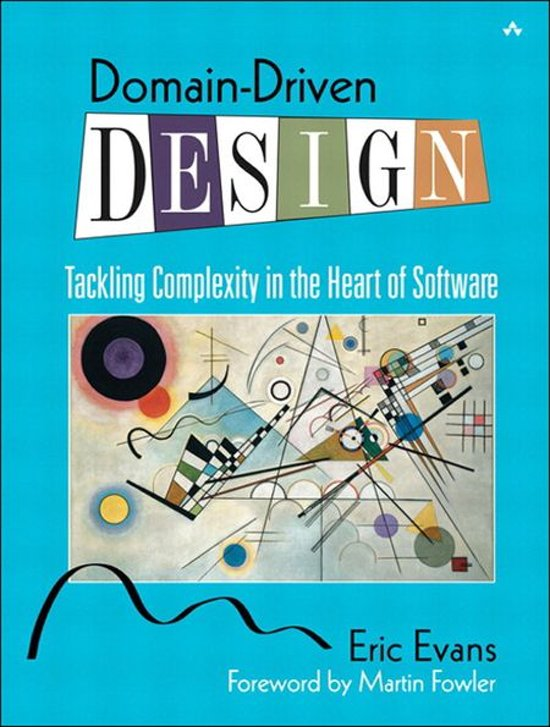
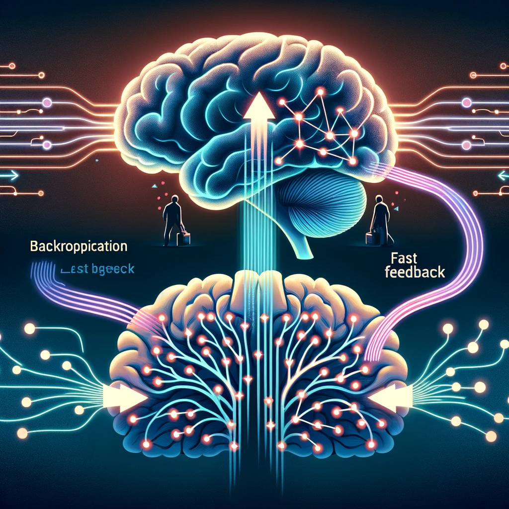
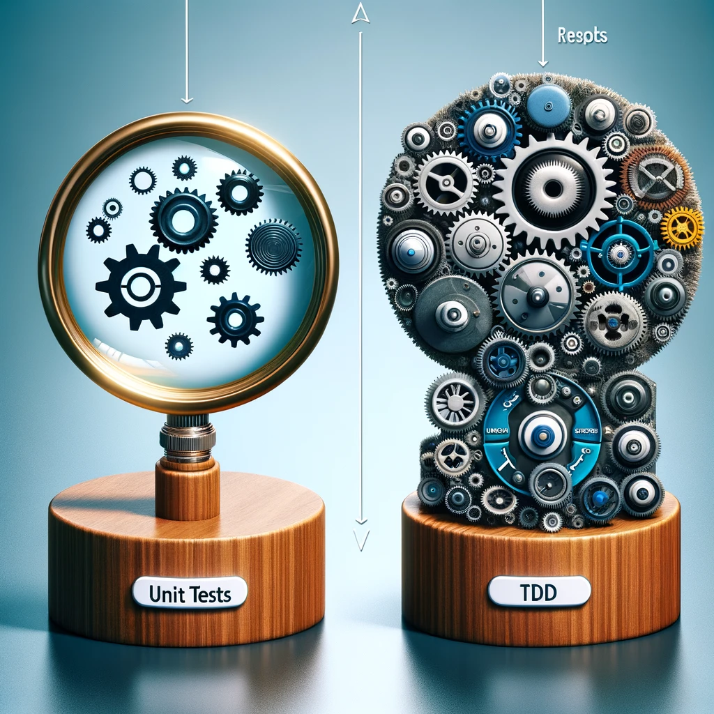

# **Test-driven Development (TDD): Warum ist das eine sehr gute Idee ?**

<!-- 
* Herzlich Willkommen zum Vortag TDD

Test-driven Development (TDD): Warum ist das eine sehr gute Idee ?

* Schön dass Ihr da seid! 

# Werbetext: 
Selbst in großen Software-Projekten wird oft erst ganz am Ende getestet – warum aber halten so viele Entwickelnde fast schon dogmatisch an dieser „Test Last“-Philosophie fest? 

Im Vortrag gehen wir dieser Frage gemeinsam auf den Grund. Auf dem Weg zu einer Antwort klären wir außerdem, was mit Test-driven Development und Test First überhaupt gemeint ist, untersuchen den Status Quo und tragen mit einem Blick in Literatur sowie einschlägige Studien die vielen nachgewiesenen Vorteile dieser Entwicklungsmethoden zusammen. 

Wir wollen Vorurteile abbauen und die wichtigsten Fragen rund um Test-driven Development beantworten.

In diesem rund 45minütigen Vortrag erfährst du, wer TDD „erfunden“ hat, was dahinter steckt, welche Versprechungen TDD macht, welche bekannten Softwareprojekte und -Teams TDD verwenden und was die empirische Forschung dazu bis dato herausgefunden hat.

-->
---

# Warum bis **du** hier ?

<!--
* kann schon früher starten bis die Nachzügler kommen

* Stimmen aus dem Publikum, jeweils 1-2 Sätze
* was erwartest du ?
* Warum ausgerechnet in einem TDD - Vortrag ?

* Warum bin ICH hier und was biete ich hier an  ? 
* Euch zu erklären WARUM Ihr euch näher mit dem Thema befassen sollte
* ich erkläre NICHT wie TDD im Detail funktioniert (mach ein Tutorial oder les ein Buch zum Thema )
* KEIN Workshop 
* NICHT für Fortgeschrittenen, für die Fortgeschrittenen ist der NÄchste Vortrag in 1 Stunde

-->

---

# Hast du TDD schon mal selbst ausprobiert?
Umfrage: https://www.menti.com/al9bcx57niwx
<!-- 
* https://www.mentimeter.com/app/presentation/n/alhyyrr74bsywk5qzdr4eoki42pem5nz/present?question=fry1o938t3s5
-->
---

## Wer ich bin:
* Bodo Teichmann
* Softwareentwickler seit mehr als 30 Jahren
* "early adopter" von TDD 
* 6 Jahre `C` Erfahrung, 10 Jahre `Java`
* CI-Automatisierung, ein wenig `Angular`, diverse Script Sprachen, 
* zuletzt 2 Jahre `Spring Boot`
<!--
* Hobbies: Musik, Fliegen, Tanzen 
-->

---

# Warum solltet Ihr jemandem vertrauen... 
... der euch empfiehlt, **X**  zu lernen? 
<!-- 
* in der Geschichte der Softwareentwicklung gab es auch anderen grundlegende Werke die nach wie vor gültig sind, z.B. "Design Patterns" von 1994
* die heute in vielen erfolgreichen Softwareprojekten und Fameworks (z.B. Spring Boot, Angular) nach wie vor verwendet werden
* TDD gehört da aus meiner Sicht auch dazu

-->
---

# Warum solltet Ihr jemandem vertrauen... 
... obwohl du nicht sofort verstehst, warum **Y**  eine gute Idee ist?
<!-- 
* oder Domain-Driven Design (ca 2003)

* METRIK: wieviele andere Veröffentlichung verweisen auf ein Buch/Konzept
-->
---

# Dicke (theoretische) Bücher lesen ?
oder doch lieber
# "learning by doing" ? 
<!--
* Es gibt viele Konzepte in der Softwareentwicklung für die man erst mal eine 
theoretische Idee , ein mentales Modell braucht um sich der Sache praktisch anzunähern

* Manche sind intuitiver andere nicht. 
* Machen habe eine flache Lernkurfe, lasses sich also incrementell erschließen
* andere haben eine Steile Lernkurfe, stellen also eine Anfangs höhere Hürde dar
-->
---

# Reden wir darüber, wie Menschen (und Maschinen) lernen 
... wenn das Lernen ein schnelles Feedback gibt
<!-- 
# Radfahren
# Singen oder ein Instrument 
# Computerspiele sind extrem nach dem Muster gestrickt möglichst schneller Feedback eines Erfolgserlebnisses zu vermitteln, damit der Spieler dabei bleibt.
 -->
---

# Reden wir darüber, wie Menschen (und Maschinen) lernen 
... wenn das Lernen **KEIN schnelles** Feedback gibt
z.B. 
* schreiben lernen
* Latein als Fremdsprache lernen
<!--
das ist leider deutlich weniger Fun , weil es kein schnelles Feedback einer Erfolgserlebnisses gibt
-->

---
# FRAGE: 
Wer von euch hat etwas schwieriges mühsam gelernt und erst viel später den Nutzen verstanden ?
<!-- 
# DISKUSSION, 
# NOTFALLS Beispiele:
# Latein lernen und Jahrs später froh sein, dass man diese Studienvorraussetzung schon hat.
# langfristig gut wartbare und erweiterbar Software schreiben 
## gute automatische Testabdeckung und sich Monate später nicht ängstigen müssen, dass jede kleine Änderung ein bestehendes Feature kaputt macht. 
-->
---

# Wie lernt  Mensch (oder eine Maschine) trotzdem ohne schnelles Feedback?
* Maschine: historische Daten sammeln
* Mensch: historische Daten sammeln (von Menschen vor euch, die die Erfahrung gemacht haben) 
* Regeln lernen und befolgen, auch wenn man erstmal keinen unmittelbaren Nutzen sieht.

---

# **Test Driven Development**
* Grundidee: Test First! 
* Also: Wir schreiben automatisch Tests **BEVOR** wir den Produktions-Code schreiben 

<!-- 
* Buchcover ist die erste fundierte Veröffentlichung
* zum Thema TDD von ca 2002 
* vorher schon im Rahmen des "Extreme Programming" vom gleichen Autor in 1999 in Kapitel 18 auf nur 4 Seiten erwähnt.
* also vor 22 Jahren,
* der Autor selbst und viele anderen haben das Konzept über die Jahre  in vielen Aspekte ergänzt
* Grundkonzept ist aber nach wie vor gültige

# Autor konnte aber die vielen Missverständnisse beim Lernen des Konzepts nicht vorhersehen.
# daher kommen mache wichtige Punkte vielleicht nicht sofort klar rüber
# daher wichtig auch, sich mit den häufigsten Fehler bei Anwendung des TDD Konzept zu befassen. 
# z.B. Video von Ian Cooper 

* nicht unbedingt der beste Einstieg ins Thema aber das erste grundlegende Buch vom "Erfinder" selbst
* Idee basiert auf jahrelanger Vorerfahrung und Expermentieren des Autors 

-->
---
# Warum ist TDD so (scheinbar) schwierig zu lernen?
-> kein schnelles Feedback!
und
* das Thema hat viele Aspekte.
* Nimm dir Zeit dich dem Thema anzunähern
* Rückschläge sind zu erwarten
* Der Weg ist das Ziel
<!--
# kein schnelles Feedback, wenn es gut funktioniert
# auch kein schnelles Feedback, wenn bei TDD Fehler gemacht werden
# Feedbackschleife bemisst sich in Monaten oder gar Jahren
# Hinweis auf TDD-Buch: gesammelte Erfahrung  über viele Jahre des Autors 
-->

---

# Wer kam schon mal zu einem schon länger bestehenden großen Softwareprojekt dazu, das nicht nur...
* vorbildliche Testabdeckung hatte, 
* also sehr stabil im Betrieb war, 
* sondern auch durchdachte leicht verständliche Architektur hatte
* die auch noch leicht erweiterbar war ?

->[Abstimmung](https://www.menti.com/al9bcx57niwx)

<!-- 
Hint: Spring Boot 
-->

---

# Was soll TDD (angeblich) leisten ?
offensichtlich Stabilität und Qualität 

... und weniger offensichtlich ? ...

---

# TDD -> fast automatisch bessere Architektur
... durch die der Code besser verständlich ist,
... besser wartbar bleibt
... und sich leichter an neue Anforderungen anpassen lässt

---

# TDD ist NICHT Unittests !
... sondern eher das Gegenteil, wenn man nach der Definition von "Unittests" in Wikipedia geht !

<!--

- Unit-Tests das Testen der 'Unit' in Isolation mit Mocks bevorzugen,
- vs TDD Programmierer Tests Vermeiden von Mocks, nur externe Dependencies 
- sondern versteht die __Einheit__ als möglicherweise größere Entität als eine Klasse in Java. 
- Ein TDD-Programmierer testet ein ganzes Modul aus vielen Klassen oder sogar einen REST-Service mit Controller UND Service UND Repository. 
- nur die Datenbank wird vieleicht weggemockt
- verwirrender Weise ist trotzdem Junit5 ein gute Werkzeug auch für TDD 

-->
---

# Wie geht TDD ?

* TDD ist **NICHT** Testklasse:Implemetationklasse 1:1 -> führt zu viele Problemen !
* TDD ist **NICHT GLEICH** Unittests !
* Junit ist **nur** ein gutes Werkzeug und definiert nicht die Methode mit der man vorgeht!

---
# "JUnit" als Tool auch für TDD hilfreich
... "Unittest" als Begriff wird  oft auch abseits der Definition von Wikipedia verwendet, z.B: Unit-Test-tool "xJunit", z.B. "JUnit"

---

# Wie geht TDD ?
... ganz einfach (wirklich ?)

---
<!-- footer: '🔗substack.com/home/post/p-139601698'  
backgroundImage: url(assets/images/Cannon-TDD.png) 
backgroundSize: 103% 103%
backgroundPosition: top 0px right 0px-->

<!--
# Flowchart vom Autor Kent Beck selbst autorisiert 
# zugehöriger Text im Substack Link zu finden.

-->
---

<!--  footer: '🔗bodote.github.io' 
backgroundImage: url(assets/images/BRANDAD_Logo.png)
backgroundSize: 150px 
backgroundPosition: top 20px right 20px
-->

# Wann passt TDD nicht ?

<!--
- NEIN: legacy code mit schlechter Test-Code Abdeckung.
- NEIN: Frontend : Layout und Texte nicht mit TDD; 
- NEIN: kurzfristige , kleine Projekte, großer Zeitdruck (->im START_UP)
- JA : Frontend - User interaction : sehr gut mit TDD
-->

---

# TDD führt (automatisch) zu besserer Softwarearchitektur ?

wirklich ? Ja, siehe auf [bodote.github.io: TDD Blog Teil 2: Architektur](https://bodote.github.io/blog/TDD-TestFirst-Teil2-Architektur/)

---

# Beweise, Beweise !

<!-- 

-  Bücher über TDD selbst, werden immer wieder neu herausgebracht. Kent Becks Buch ist also bei weitem nicht das Bücher über Softwarearchitektur z.B.

- eine Reihe von wissenschaftlichen Studien, z.T. sogar richtige Vergleichsstudien

- eine Reihe von systematischen Erfahrungsberichten aus verschiedenen großen Unternehmen.

- sogar einige Metastudien zu dem Thema konnte ich finden.
-->

---

# Hier nur ein Auszug 
... alle Links findest du auf [bodote.github.io: TDD Blog Teil 3: Beweise etc.](https://bodote.github.io/blog/Literaturrecherche-TDD/)

---

- ["The Spring team advocates test-driven development,TDD ."](https://docs.spring.io/spring-framework/docs/current/reference/html/testing.html)

  > "Das Spring Team unterstützt und beführwortet TestDrivenDevelopment.

- [VMware Pivotal Labs Website](https://tanzu.vmware.com/content/blog/go-faster-write-tests-first)

  > "Wir praktizieren selbst TestDrivenDeveopment. Da heißt, bevor wir die Arbeit an einem neuen Feature beginnen, schreiben wir zuerst einen Test, der das gewünschte Verhalten genau beschreibt."

- [IBM: Assessing test-driven development](https://collaboration.csc.ncsu.edu/laurie/Papers/MAXIMILIEN_WILLIAMS.PDF)

  > **50% weniger Bugs** als bei "test last", [bei zunächst] minimaler geringere Produktivität 

---

- [Microsoft: Evaluating the Efficacy of Test-Driven Development: Industrial Case Studies](https://d1wqtxts1xzle7.cloudfront.net/36509027/fp17288-bhat.pdf?1423032149=&response-content-disposition=inline%3B+filename%3DEvaluating_the_Efficacy_of_Test_Driven_D.pdf&Expires=1599907639&Signature=RuaKEjh7AbrkimLa5LGjb6zOpojv18srJrYQO7ONLNjWm586g6nxlDjGnYgubwIFYYp5fNkQulFn6YD3wpvud5bBhvwkO4nOOFMYyhATLdvHjHtW3vzm6ncsuqgwYTIKtrxbxAd7lQiEiue~D300FsgSLK6ZUk9DOssTqS0NZry6syc9I6IQYR6H2BRcnzf9oxvCTBWPzjSEBPi2cqYpyKbF1Y322XtLj7fdNTu8IVkmUULxwH3R1GVsEZrdpOAOJpM0b1ZAsJZEI0K3hiv~ENiV79hUjoyRu5xLaDeDWA4Nhg4Q-J8Zu8UQ18hQEjl0dOZnq7o4Xq~2-8jbuzDxIQ__&Key-Pair-Id=APKAJLOHF5GGSLRBV4ZA)

  > **Bugrate sinkt mit TDD um 62%-77%** , [initial] 15% -35% mehr Zeit für TDD notwendig.

- [Metastudie, die 6 unterschiedliche andere Studien ausgewertet hat](https://digitalcommons.calpoly.edu/cgi/viewcontent.cgi?article=1027&context=csse_fac)

  > Ergebnis: deutlich **Positiv, auch bezüglich Software-Architektur**

- [An Experimental Evaluation of the Effectiveness and Efficiency of the Test Driven Development](https://ieeexplore.ieee.org/abstract/document/4343756)

  > **deutlich bessere Gesamt-Produktivität und Codequalität**

---

- [noch eine Metastudie](https://www.researchgate.net/profile/Burak_Turhan/publication/258126622_How_Effective_is_Test_Driven_Development/links/54e794320cf27a6de10a8afe/How-Effective-is-Test-Driven-Development.pdf)

  > Gesamturteil deutlich positiv, aber Hinweis: "schwer zu meistern" , **Fazit: Empfehlung für TDD**

- [Empirische Studie zu Test-Driven Development](https://link.springer.com/book/10.1007%2F978-3-642-04288-1)
  > " _Test First_ ist **besser** darin, **lose gekoppelte** Softwarekomponenten hervorzubringen als _test last_." _Lose gekoppelt_ bewirkt zum Beispiel bessere Wartbarkeit, Verständlichkeit für die Entwickler, ist also was sehr gutes.

---

# Neugierig geworden?

-> [zur Abstimmung](https://www.menti.com/al9bcx57niwx)

---

# Danke für eure Aufmerksamkeit!

---

# BRANDAD Development GmbH

* Wir suchen Softwareentwickler, Scrummaster, Product Owner, UI/UX-ExpertInnen
* viel Angular und Spring-boot, aber auch anderen Frameworks, offen für neues
* [https://brandad.dev](https://brandad.dev)

---

# BRANDAD Development GmbH

* Wir suchen Softwareentwickler, Scrummaster, Product Owner, UI/UX-ExpertInnen
* viel Angular und Spring-boot, aber auch anderen Frameworks, offen für neues
* [https://brandad.dev](https://brandad.dev)