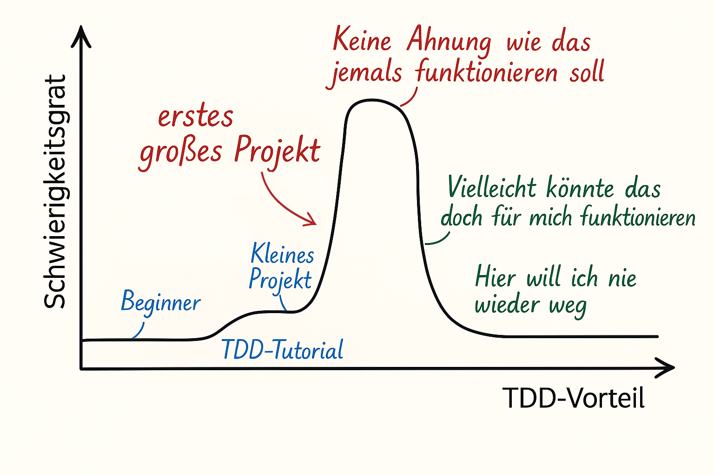
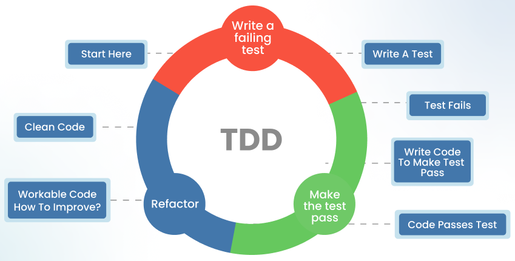
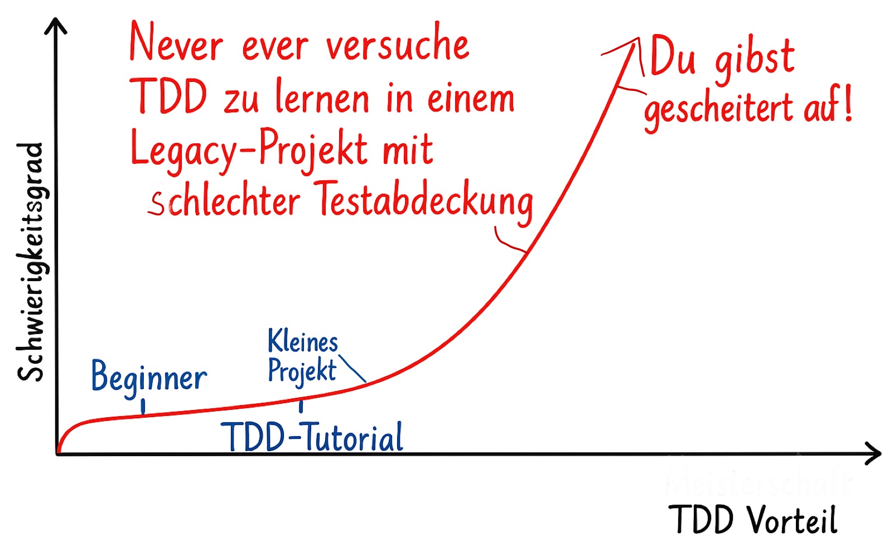
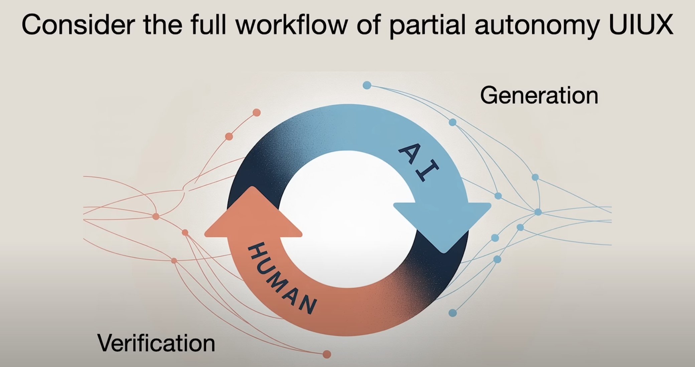

# Test-driven Development (TDD): Warum ist das eine sehr gute Idee ?

<!-- 
* Herzlich Willkommen zum Vortag TDD

Test-driven Development (TDD): Warum ist das eine sehr gute Idee ?

* Schön dass Ihr da seid! 

# Werbetext: 
Selbst in großen Software-Projekten wird oft erst ganz am Ende getestet – woher aber kommt diese „Test Last“-Philosophie und warum halten so viele Entwickler so überzeugt daran fest? 

In diesem zweiteiligen Vortrag gehen wir gemeinsam zuerst dieser sehr grundsätzlichen Frage  nach. Auf dem Weg zu einer Antwort klären wir außerdem, was mit Test-driven Development und Test First überhaupt gemeint ist, untersuchen den Status Quo und tragen mit einem Blick in Literatur sowie einschlägige Studien die vielen nachgewiesenen Vorteile dieser Entwicklungsmethoden zusammen. 

Wir wollen Vorurteile abbauen und die wichtigsten Fragen rund um Test-driven Development beantworten. Und wir schauen uns an, wie KI uns das Leben mit TDD vereinfachen kann.

Teil 1 (15:00 Uhr – 16:30 Uhr): Test-Driven Development (TDD): Warum ist das eine sehr gute Idee?
Warum ist das „Test-First“-Prinzip von TDD besser als „Test Last“? TDD konsequent umzusetzen ist für viele schwerer als gedacht. Wir gehen dem Thema theoretisch auf den Grund.

-->
---

# Warum bis **du** hier ?

<!-- 
* kann schon früher starten bis die Nachzügler kommen

* Stimmen aus dem Publikum, jeweils 1-2 Sätze

* was erwartest du ?

* Warum ausgerechnet in einem TDD - Vortrag ?

* Warum bin ICH hier und was biete ich hier an  ? 

* Euch zu erklären WARUM Ihr euch näher mit dem Thema befassen sollte

* ich erkläre NICHT wie TDD im Detail funktioniert (mach ein Tutorial oder les ein Buch zum Thema )

* KEIN Workshop 

* NICHT für Fortgeschrittenen, für die Fortgeschrittenen ist der NÄchste Vortrag in 1 Stunde

-->

---

# Hast du TDD schon mal selbst ausprobiert?
[https://www.menti.com/al9bcx57niwx](https://www.menti.com/al9bcx57niwx)
<!-- notes:
* https://www.mentimeter.com/app/presentation/n/alhyyrr74bsywk5qzdr4eoki42pem5nz/present?question=fry1o938t3s5
-->
---

## Wer ich bin:
* Bodo Teichmann
* Softwareentwickler seit mehr als 30 Jahren
* "early adopter" von TDD 
* 6 Jahre `C` Erfahrung, 10 Jahre `Java`
* CI-Automatisierung, ein wenig `Angular`, diverse Script Sprachen, 
* zuletzt 3 Jahre `Spring Boot`
<!-- 
* Hobbies: Musik, Fliegen, Tanzen 
-->
---

# Was ist TDD ? 

TDD = **Test-Driven Development**

* **Test** First!
* **Driven**: erst Test dann Produktions-Code
* **Tests**:  automatisiert, nicht manuelle Tests

<!--
TEST FIRST, also Tests schreiben **BEVOR** der Produktions-Code geschrieben wird

DRIVEN , also der Test-Code treibt die Entwicklung des Produktions-Codes an

DEVELPOPMENT , also Softwareentwicklung, nicht nur Tests schreiben

TESTS, also automatisierte Tests, nicht manuelle Tests

Ich könnte jetzt WEITERMACHEN und euch erklären, wie TDD funktioniert, aber das ist nicht das Ziel dieses Vortrags

da gibt es soo viel Tutorials, Büchern, Videos, Blogs, ...

-->
---

<!-- 
Es gibt ein Problem mit TDD:

TDD ist nicht so einfach zu lernen, wie es aussieht

-->

---

<!-- 
ich muss euch motivieren, euch mit dem Thema zu befassen obwohl es nicht so einfach ist, wie es aussieht

ich muss Vertrauen bei euch herstellen dass es sich lohnt, sich mit dem Thema zu befassen, obwohl es nicht so einfach ist, wie es aussieht

-->
---

# Vertrauen aufbauen

<!-- 
ich muss euch motivieren, euch mit dem Thema zu befassen obwohl es nicht so einfach ist, wie es aussieht

ich muss Vertrauen bei euch herstellen dass es sich lohnt, sich mit dem Thema zu befassen, obwohl es nicht so einfach ist, wie es aussieht

-->
---

# Warum solltet Ihr jemandem vertrauen... 
... der euch empfiehlt, **X**  zu lernen? 

nach 32 Jahren AMAZON Verkaufsrang 3 (Objectorientiertes Softwaredesign )
<!-- 
in der Geschichte der Softwareentwicklung gab es auch anderen grundlegende Werke die nach wie vor gültig sind, z.B. "Design Patterns" 

von 1994

die heute in vielen erfolgreichen Softwareprojekten und Fameworks (z.B. Spring Boot, Angular) nach wie vor verwendet werden

AMAZON Verkaufsrang 3 (Object Oriented Softwaredesign )

-->
---

# Warum solltet Ihr ein anspruchsvolles Konzept lernen... 

obwohl....
<!-- 
oder Domain-Driven Design (ca 2003) verkaufsrang 7 bei AMAZON

... obwohl du nicht sofort verstehst, warum das eine gute Idee ist?

... obwohl du für deine Übungsprojekte in deiner Ausbildung auch prima ohne ausgekommen bist?

... obwohl deswegen dein Ausbilder das Thema nichtmal erwähnt hat?

METRIK: wie oft wird ein  Buch/Konzept zitiert ?

-->
---

# **Test Driven Development**
* Grundidee: Test First! 
* Also: Wir schreiben automatisch Tests **BEVOR** wir den Produktions-Code schreiben 

<!-- 

TDD gehört da aus meiner Sicht auch dazu

von 2002 (erste Idee veröffentlich 1999) 

wird nach wie vor aufgelegt, immer noch aktuell

also vor 23 Jahren,

der Autor selbst und viele anderen haben das Konzept über die Jahre  in vielen Aspekte ergänzt

Grundkonzept ist aber nach wie vor gültige

Autor konnte aber die vielen Missverständnisse beim Lernen des Konzepts nicht vorhersehen.

daher kommen mache wichtige Punkte vielleicht nicht sofort klar rüber

daher wichtig auch, sich mit den häufigsten Fehler bei Anwendung des TDD Konzept zu befassen. 

nicht unbedingt der beste Einstieg ins Thema aber das erste grundlegende Buch vom "Erfinder" selbst

Idee basiert auf jahrelanger Vorerfahrung und Expermentieren des Autors 

-->
---

# **Buch lesen und fertig ?**

<!-- 
Es gibt viele Konzepte in der Softwareentwicklung für die man erst mal eine 
theoretische Idee , ein mentales Modell braucht um sich der Sache praktisch anzunähern

Manche sind intuitiver andere nicht. 

Machen habe eine flache Lernkurfe, lasses sich also incrementell erschließen

andere haben eine Steile Lernkurfe, stellen also eine Anfangs höhere Hürde dar

manche scheinen so einfach, aber plötzlich meint man in einer Sackgasse zu stecken.

manche Konzepte spielen erst in größeren Projekten ihre Stärken aus
-->

---

---

# Reden wir darüber, wie Menschen (und Maschinen) lernen 
... wenn das Lernen ein schnelles Feedback gibt
<!-- 
Radfahren

Singen oder ein Instrument 

Computerspiele sind extrem nach dem Muster gestrickt möglichst schneller Feedback eines Erfolgserlebnisses zu vermitteln, damit der Spieler dabei bleibt.
 -->
---

# Reden wir darüber, wie Menschen (und Maschinen) lernen 
... wenn das Lernen **KEIN schnelles** Feedback gibt
z.B. 
* schreiben lernen
* eine Fremdsprache lernen
<!--
das ist leider deutlich weniger Fun , weil es kein schnelles Feedback einer Erfolgserlebnisses gibt
-->

---

# FRAGE: 
Wer von euch hat etwas schwieriges mühsam gelernt und erst viel später den Nutzen verstanden ?
<!-- 
# DISKUSSION, 
# NOTFALLS Beispiele:

 Latein lernen und Jahrs später froh sein, dass man diese Studienvorraussetzung schon hat.

 langfristig gut wartbare und erweiterbar Software schreiben 

 gute automatische Testabdeckung und sich Monate später nicht ängstigen müssen, dass jede kleine Änderung ein bestehendes Feature kaputt macht. 
-->
---

# Wie lernt  Mensch (oder eine Maschine) trotzdem ohne schnelles Feedback?
* Maschine: historische Daten sammeln
* Mensch: historische Daten sammeln (von Menschen vor euch, die die Erfahrung gemacht haben) 

---

# Wie lernt  Mensch (oder eine Maschine) trotzdem ohne schnelles Feedback?

<!-- 

Ich hoffe jetzt dass ihr jetzt das nötige Vertrauen habt, dass es sich lohnt, sich mit dem Thema TDD zu befassen.

Um den Regeln zu folgen, bis du ein schließlich ein tiefes Verständnis für das Thema hast und die Regeln auch ohne Nachdenken befolgen kannst.

-->

---

# Warum ist TDD so (scheinbar) schwierig zu lernen?
-> kein schnelles Feedback!
und
* das Thema hat viele Aspekte.
* Nimm dir Zeit dich dem Thema anzunähern
* Rückschläge sind zu erwarten
* Der Weg ist das Ziel
<!--
# kein schnelles Feedback, wenn es gut funktioniert
# auch kein schnelles Feedback, wenn bei TDD Fehler gemacht werden
# Feedbackschleife bemisst sich in Monaten oder gar Jahren
# Hinweis auf TDD-Buch: gesammelte Erfahrung  über viele Jahre des Autors 
-->

---

# Wer kam schon mal zu einem schon länger bestehenden großen Softwareprojekt dazu, das nicht nur...
* vorbildliche Testabdeckung hatte, 
* also sehr stabil im Betrieb war, 
* sondern auch durchdachte leicht verständliche Architektur hatte
* die auch noch leicht erweiterbar war ?
* [Mentimeter https://www.menti.com/al9bcx57niwx ](https://www.mentimeter.com/app/presentation/alhyyrr74bsywk5qzdr4eoki42pem5nz/present?question=2ttp9u1s9hi2)

<!-- 

warum scheitert ein Großteil der Softwareprojekte in Unternehmen ?
machen Untersuchungen sprechen von 50%

75% haben erhebliche Probleme mit Zeit oder Budgetüberschreitungen

Schlechte Ausbildung der Entwickler,
damit schlechte Methodik

andere Gründe : unklare Anforderungen 

Positiv Beispiel: Spring Boot  (später mehr)

also : viele von Euch haben noch keine positive praktischer Erfahrung mit TDD gemacht, oder ?

-->

---

# Was soll TDD (angeblich) leisten ?
* offensichtlich Stabilität und Qualität 
* ... und weniger offensichtlich ? ...

---

# TDD -> fast automatisch bessere Architektur
* ... durch die der Code besser verständlich ist,
* ... besser wartbar bleibt
* ... und sich leichter an neue Anforderungen anpassen lässt

---

# TDD ist NICHT Unittests !
... sondern eher das Gegenteil, wenn man nach der Definition von "Unittests" in Wikipedia geht !

<!--
ABER du must TDD auch RICHTIG anwenden.

Was du alles falsch machen kannst (und wirst) -> siehe Teil 2 des Vortrags später

 

-->
---

# Wie geht TDD ?

* TDD ist **NICHT** Testklasse:Implemetationklasse 1:1 -> führt zu viele Problemen !
* TDD ist **NICHT GLEICH** Unittests !
* Junit ist **nur** ein gutes Werkzeug und definiert nicht die Methode mit der man vorgeht!

<!--

A fool with a tool is still a fool!

Unit-Tests das Testen der 'Unit' in Isolation mit Mocks bevorzugen,

(besser  TDD Programmierer Tests Vermeiden von Mocks, nur externe Dependencies Mocken) 

sondern versteht die __Einheit__ als möglicherweise größere Entität als eine Klasse in Java. 

Ein TDD-Programmierer testet ein ganzes Modul aus vielen Klassen oder sogar einen REST-Service mit Controller UND Service UND Repository. 

nur die Datenbank wird vieleicht weggemockt

verwirrender Weise ist trotzdem Junit5 ein gute Werkzeug auch für TDD 

-->

---
# "JUnit" als Tool auch für TDD hilfreich
... "Unittest" als Begriff wird  oft auch abseits der Definition von Wikipedia verwendet, z.B: Unit-Test-tool "xUnit", z.B. "JUnit"

<!-- das ist übrigens einer der Punkte die im Buch von Kent Beck nicht wirklich klar herausgestellt wurde -->
---

# Wie geht TDD ?
... ganz einfach (wirklich ?)

---
<!-- footer: '🔗https://substack.com/home/post/p-139601698'  
backgroundImage: url(assets/images/Cannon-TDD.png) 
backgroundSize: 103% 103%
backgroundPosition: top 0px right 0px-->

<!--
die orangenen Kästen weise auf mögliche Fehler hin, die oft gemacht werden

Flowchart vom Autor Kent Beck selbst autorisiert 
zugehöriger Text im Substack Link zu finden.

-->
---

<!--  footer: '🔗https://bodote.github.io' 
backgroundImage: url(assets/images/BRANDAD_Logo.png)
backgroundSize: 150px 
backgroundPosition: top 20px right 20px
-->

# Wann passt TDD nicht ?

<!--
- NEIN: legacy code mit schlechter Test-Code Abdeckung.
- NEIN: Frontend : Layout und Texte nicht mit TDD; 
- NEIN: kurzfristige , kleine Projekte, großer Zeitdruck (->im START_UP)
- JA : Frontend - User interaction : sehr gut mit TDD
-->

---

<!-- 
wenn überhaupt , dann erstmal Testabdeckung schaffen für schon existierenden Code, hat aber erstmal nix mit TDD zu tun

aber EIGENTLICH rate ich euch: lasst die Finger davon und Augen auf bei der Projektwahl

NACH so viel WARNUNGEN 

-->

---

* TDD ist aber nicht so einfach zu lernen, wie es aussieht
* du kannst auch viel falsch machen.
* TDD macht große Versprechungen

<!--
beim ersten Punkt kann ich euch leider nicht wirklich helfen 

-> Bücker lesen , Videos schauen , Tutorials anschauen und dann einfach machen 

Die wichtigsten Irrtümer, Missverständnisse und Fallen bei TDD werde ich im zweiten Teil des Vortrags behandeln.

Zu den großen Versprechungen kommen wir jetzt:

-->

---

# Beweise, Beweise !

<!-- 

- Bücher über TDD selbst, werden immer wieder neu herausgebracht. Kent Becks Buch ist also bei weitem nicht das Bücher über Softwarearchitektur z.B.

- eine Reihe von wissenschaftlichen Studien, z.T. sogar richtige Vergleichsstudien

- eine Reihe von systematischen Erfahrungsberichten aus verschiedenen großen Unternehmen.

- sogar einige Metastudien zu dem Thema konnte ich finden.
-->
---

# TDD führt (automatisch) zu besserer Softwarearchitektur ?

* wirklich ? 
* Ja, siehe ausführlich unter [bodote.github.io: TDD Blog Teil 2: Architektur](https://bodote.github.io/blog/TDD-TestFirst-Teil2-Architektur/)

---

# Hier nur ein Auszug 
... alle Links findest du auf [bodote.github.io: TDD Blog Teil 3: Beweise etc.](https://bodote.github.io/blog/Literaturrecherche-TDD/)

---
# Studien über TDD
* ["The Spring team advocates test-driven development,TDD ."](https://docs.spring.io/spring-framework/docs/current/reference/html/testing.html)

  > "Das Spring Team unterstützt und beführwortet TestDrivenDevelopment.

* [VMware Pivotal Labs Website](https://tanzu.vmware.com/content/blog/go-faster-write-tests-first)

  > "Wir praktizieren selbst TestDrivenDeveopment. Da heißt, bevor wir die Arbeit an einem neuen Feature beginnen, schreiben wir zuerst einen Test, der das gewünschte Verhalten genau beschreibt."

* [IBM: Assessing test-driven development](https://collaboration.csc.ncsu.edu/laurie/Papers/MAXIMILIEN_WILLIAMS.PDF)

  > **50% weniger Bugs** als bei "test last", [bei zunächst] minimaler geringere Produktivität 

---
# Studien über TDD (2)
* [Microsoft: Evaluating the Efficacy of Test-Driven Development: Industrial Case Studies](https://d1wqtxts1xzle7.cloudfront.net/36509027/fp17288-bhat.pdf?1423032149=&response-content-disposition=inline%3B+filename%3DEvaluating_the_Efficacy_of_Test_Driven_D.pdf&Expires=1599907639&Signature=RuaKEjh7AbrkimLa5LGjb6zOpojv18srJrYQO7ONLNjWm586g6nxlDjGnYgubwIFYYp5fNkQulFn6YD3wpvud5bBhvwkO4nOOFMYyhATLdvHjHtW3vzm6ncsuqgwYTIKtrxbxAd7lQiEiue~D300FsgSLK6ZUk9DOssTqS0NZry6syc9I6IQYR6H2BRcnzf9oxvCTBWPzjSEBPi2cqYpyKbF1Y322XtLj7fdNTu8IVkmUULxwH3R1GVsEZrdpOAOJpM0b1ZAsJZEI0K3hiv~ENiV79hUjoyRu5xLaDeDWA4Nhg4Q-J8Zu8UQ18hQEjl0dOZnq7o4Xq~2-8jbuzDxIQ__&Key-Pair-Id=APKAJLOHF5GGSLRBV4ZA)
  > **Bugrate sinkt mit TDD um 62%-77%** , [initial] 15% -35% mehr Zeit für TDD notwendig.
* [Metastudie, die 6 unterschiedliche andere Studien ausgewertet hat](https://digitalcommons.calpoly.edu/cgi/viewcontent.cgi?article=1027&context=csse_fac)
  > Ergebnis: deutlich **Positiv, auch bezüglich Software-Architektur**
* [An Experimental Evaluation of the Effectiveness and Efficiency of the Test Driven Development](https://ieeexplore.ieee.org/abstract/document/4343756)
  > **deutlich bessere Gesamt-Produktivität und Codequalität**

---
# Studien über TDD (3)

* [noch eine Metastudie](https://www.researchgate.net/profile/Burak_Turhan/publication/258126622_How_Effective_is_Test_Driven_Development/links/54e794320cf27a6de10a8afe/How-Effective-is-Test-Driven-Development.pdf)

  > Gesamturteil deutlich positiv, aber Hinweis: "schwer zu meistern" , **Fazit: Empfehlung für TDD**

* [Empirische Studie zu Test-Driven Development](https://link.springer.com/book/10.1007%2F978-3-642-04288-1)
  > " _Test First_ ist **besser** darin, **lose gekoppelte** Softwarekomponenten hervorzubringen als _test last_." _Lose gekoppelt_ bewirkt zum Beispiel bessere Wartbarkeit, Verständlichkeit für die Entwickler, ist also was sehr gutes.

---

# TDD und AI-assisted coding

Ist TDD in Zeiten von KI-unterstützter Sofwareentwicklung noch sinnvoll ?

---

<!-- footer: '🔗https://www.publicissapient.com/insights/guide-to-ai-assisted-software-development'  
backgroundImage: url(assets/images/ai-assisted-development.webp) 
backgroundSize: 103% 103%
backgroundPosition: top 0px right 0px-->
<!--
 Auf jeden Fall!

 funktioniert so gar sehr gut.

 in "Cursor" entscheidend: 

1. ein Regelset

2. ein Test-Framework(s) genau vorgeben und beschreiben wir es anzuwenden ist

3. das "richtige" LLM verwenden (Claude-4-sonnet (thinking))

-->

---
<!--  footer: '🔗https://bodote.github.io' 
backgroundImage: url(assets/images/BRANDAD_Logo.png)
backgroundSize: 150px 
backgroundPosition: top 20px right 20px
-->
# TDD und AI-assisted coding
 
Zitat aus :[Andrej Karpathy: Software Is Changing (Again) vom 19.6.2025](
https://youtu.be/LCEmiRjPEtQ?si=QaQxjyuhEDy0rlRW&t=1329):

"[AI] is doing the generation , the humans are doing the verification"

---

# Neugierig geworden?

-> [zur Abstimmung](https://www.mentimeter.com/app/presentation/alhyyrr74bsywk5qzdr4eoki42pem5nz/edit?question=obhq62mfdhow)

---

# BRANDAD Development GmbH
 
- Wir suchen Softwareentwickler, Scrummaster, Product Owner, UI/UX-ExpertInnen

- viel Angular und Spring-boot, aber auch anderen Frameworks, offen für neues

- [https://brandad.dev](https://brandad.dev)

---

# BRANDAD Development GmbH

- Wir suchen Softwareentwickler, Scrummaster, Product Owner, UI/UX-ExpertInnen

- viel Angular und Spring-boot, aber auch anderen Frameworks, offen für neues

- [https://brandad.dev](https://brandad.dev)

---

# Danke für eure Aufmerksamkeit!
<!--  footer: '🔗https://bodote.github.io' 
backgroundImage: url(assets/images/BRANDAD_Logo.png)
backgroundSize: 150px 
backgroundPosition: top 20px right 20px
-->

# Fragen ?

Präsentation unter https://bodote.github.io/vortr%C3%A4ge/TDD-Nuernberg-Digital (QR-Code links)

<!-- ENDE -->
