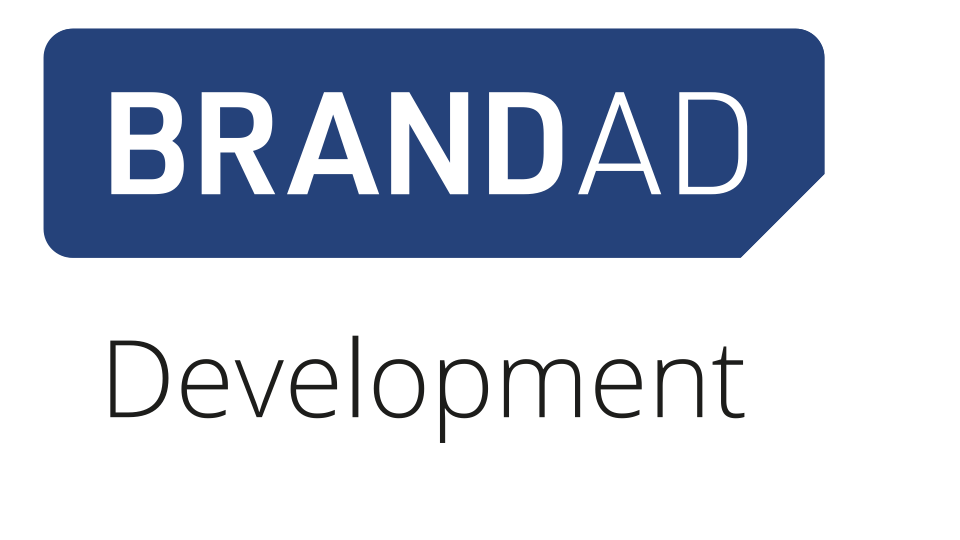
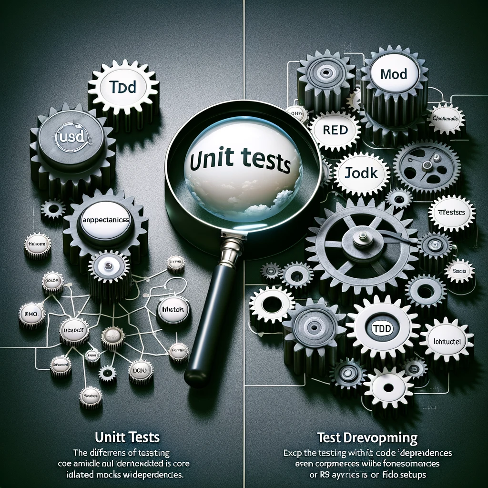
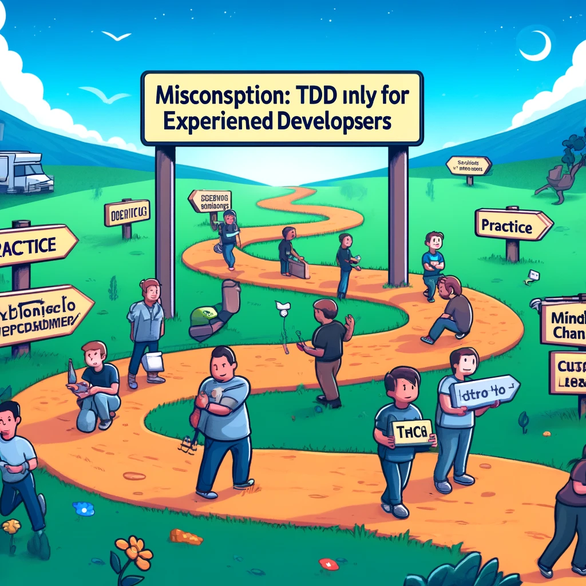

# TDD (Wieder-)Entdecken
## Fallen und Missverständnisse vermeiden
<!-- 
## Voraussetzung: Verständnis von TDD als Prozess, bei dem Tests vor dem Code geschrieben werden.
Also würde ich erwarten, dass ihr zumindest versteht, dass TDD ein Prozess ist, bei dem wir Tests schreiben, bevor wir den Code schreiben. 

## Zyklus von Rot zu Grün und Refactoring: Fehlschlagende Tests schreiben und dann passieren lassen.
Und es gibt einen Zyklus von Rot zu Grün und Refactoring, bei dem wir einen fehlschlagenden Test schreiben, dann diesen Test bestehen lassen. Und dann führen wir ein Refactoring durch, um die Qualität unseres Codes zu verbessern. Ihr solltet zumindest so viel wissen. Es spielt keine Rolle, ob ihr derzeit TDD praktiziert, es zählt nur, dass ihr versteht, worum es bei TDD geht und wie es allgemein präsentiert wird. 

## Kritik am vorherrschenden Ansatz der testgetriebenen Entwicklung, insbesondere an Ansätzen, die auf Unit-Tests und Mocks basieren.
Ein weiterer Punkt zu diesem Vortrag ist, dass ich definitiv eine Kritik an dem haben werde, was oft als vorherrschender Ansatz für testgetriebene Entwicklung angesehen wird; ich werde eine Art Ansatz kritisieren, der auf Unit-Tests, Mocks und allem anderen basiert. Und sogar Gherkin-basierte Syntax-Stil Akzeptanztests. Wenn ihr eng damit verbunden seid und niemand euch jemals überzeugen wird, dass das der falsche Weg ist, etwas zu tun, möchtet ihr vielleicht jemand anderen finden, mit dem ihr sprechen könnt, denn das werde ich heute versuchen. Und wenn das nichts für euch ist, ich möchte nichts davon hören, richtig? Kein Grund, hier zu sein. Richtig. 

## Offenheit für neue Methoden erforderlich, besonders wenn bisherige Versuche mit TDD gescheitert sind.

## Ziel des Vortrags: Verständnis für alternative TDD-Methoden bieten, die möglicherweise besser funktionieren.
Wenn ihr offen seid, werden wir versuchen, verschiedene Weisen des Vorgehens zu erklären. Und wenn ihr TDD ausprobiert habt und es für euch nicht funktioniert hat, könnte dies euch helfen zu verstehen warum, und könnte euch einen Weg aufzeigen, der vielleicht besser für euch funktioniert. Hoffentlich werdet ihr in der Lage sein, weniger, einfachere, bessere Tests zu schreiben. 

## Der Vortrag ist theoriebasiert, behandelt die korrekte Durchführung von TDD und ist nicht demo-lastig.
Dies ist auch kein codebasierter Vortrag, richtig? Dies ist ein theoriebasierter Vortrag, der die Theorie erklärt, wie man TDD korrekt durchführt. Also, wenn ihr etwas demo-lastiges wollt, ist das auch nicht dieser Vortrag. 

## ich bin auch kein Experte
Es gibt oft in Vorlesungsstil-Beziehungen ein bisschen den Eindruck, dass ich irgendwie, ihr wisst schon, der Experte bin und ihr nicht. Wir sind alle nur Softwareingenieure, ich hatte nur das Glück, vor über 20 auf die Buch über XP und TDD von Kent Beck zu stolpern und bekam dann auch die Gelegenheit rel ungestört für 2 Jahre meine ersten Erfahrungen mit Java und TDD zu machen.

aber ich bin wirklich nicht klüger als ihr? ich habe halt ein paar Sachen ausprobiert die nicht so gut funktioniert haben und ein paar die ganz gut funktioniert haben.

## viele locales Optimum

## vom Tretroller zum Fahrrad
-->
---
## Wer ich bin:
* Bodo Teichmann
* Softwareentwickler seit mehr als 30 Jahren
* "early adopter" von TDD 
* 6 Jahre `C` Erfahrung, 10 Jahre `Java`
* CI-Automatisierung, ein wenig `Angular`, diverse Script Sprachen, 
* zuletzt 2 Jahre `Spring Boot` 

---


* Wir suchen Softwareentwickler, Scrummaster, Product Owner, UI/UX-ExpertInnen
* Angular und Spring-boot
* [brandad.dev](https://brandad.dev)

---


# Die Irrtümer von TDD

--- 


# TDD, ganz einfach ?

---

<!-- 
footer: '🔗substack.com/home/post/p-139601698'  
backgroundImage: url(assets/images/Cannon-TDD.png) 
backgroundSize: 103% 103%
backgroundPosition: top 0px right 0px
-->


<!--
# Flowchart vom Autor Kent Beck selbst autorisiert 
# zugehöriger Text im Substack Link zu finden.

-->


---

<!--  footer: '🔗bodote.github.io' 
backgroundImage: url(assets/images/BRANDAD_Logo.png)
backgroundSize: 150px 
backgroundPosition: top 20px right 20px
-->

# Irrtum 1: Softwareentwickler schreiben Unittest 
<!--  TDD ist nicht gleichzusetzen mit Unit-Tests.

# Der erste und vielleicht bedeutendste Irrtum der testgetriebenen Entwicklung ist, dass Entwickler Unit-Tests schreiben. Nichts könnte weiter von der Wahrheit entfernt sein. 

-->

---
# Irrtum 1: Softwareentwickler schreiben Unittest 
## TDD hat absolut nichts mit "Unit-Tests" zu tun. 

* [Zitat](https://en.wikipedia.org/wiki/Software_testing#Unit_testing) : "Unit testing refers to verifying the behavior of a relatively small portion of the code, a unit, in **isolation from the rest of the codebase**. A unit is often a function, module, method or class. [21] To isolate the unit, a test substitutes dependences with test doubles."

* Verwirrung um den Begriff "Unit" im zusammenhang mit "Test": "Junit5" als _Tool_ ist prima!

<!--
Also, wenn ich auf Wikipedia schaue, kann ich eine vernünftige Definition von Unit-Testing bekommen, richtig. Wikipedia sagt, um Probleme, die auftreten können, zu isolieren. Jeder Testfall sollte unabhängig getestet werden, Ersatzmittel, wie Methoden-Stubs, Mock-Objekte, Fakes und Test-Harnesses können verwendet werden, um das Testen eines Moduls in Isolation zu unterstützen. Was bedeutet das? Richtig? -->

--- 

# Irrtum 1: TDD ≠ Unittesting

* Unit-Tests laut Definition konzentriert sich auf die __Isolation__ von Fehlern in einer Komponente durch den **Einsatz von Test-Doubles**.

<!-- 
# __Isolation__ von Fehlern in einer Komponente scheint erstmal eine Gute Idee
# ist es aber nicht
-->

--- 

# Irrtum 1: Das große "Unit" Missverständnis (1) 

* Isolation der Test: JA! : Isolation der getesteten "Units": vermeide wenn möglich
* Unit = zusammengehörige Code-Teil (im Sinne von DDD ) , also ein "Modul" mit defnierter API : Prima !
* Unit = Java- oder TypeScript - Klasse : großes **Missverständniss** !


<!-- Es gab eine Zeit, als wir darüber sprachen, wie wir das Testen automatisieren würden, testeten wir Module, Module nebulös definiert, richtig? Es könnte eine Klasse sein, es könnte viel größer sein. Und die Idee war, dass das Modul als Black Box behandelt wird, und dein Test das Modul von außen prüft. Und du wolltest sicherstellen, dass alle Fehler, die dein Test dir gab, innerhalb der Box waren. Also alle Abhängigkeiten, die diese Box hat, würdest du mit einem Fake oder Ersatz ersetzen, das ist klassisches automatisiertes Testen. -->

---

# Irrtum 1: "Unit" Missverständnis (2)
* "Unit" im Sinne von Kent Beck (Autor von TDD): GUT!
* J-"Unit" als Tool: sehr hilfreich, (ebenso: Jasmin, Jest)
* "Unit" als einzelne Klasse und "wegmocken" aller Dependecies : **SCHLECHT**!
* Angulars automatische *.spec.ts für jedes *.ts : **SCHLECHT** ! 

<!-- Okay. Das Problem ist, dies als Paradigma für testgetriebene Entwicklung anzuwenden. Also was passierte, als die testgetriebene Entwicklung aufkam, nahmen einige Leute, die mit automatisiertem Testen vertraut waren, an und begannen anderen Menschen beizubringen, TDD sei nur automatisiertes Testen, und das ist es nicht. Also gibt es einige Probleme damit, richtig? Das erste Problem ist, es gibt viel Fokus auf Isolation beim automatisierten Testen. Die Idee ist, dass ich für die Fehlerlokalisierung verstehen muss, dass alle Fehler in dieser Komponente sind, nicht in einem seiner Dependencies. Daher muss ich Mocks oder Test-Doubles verwenden, den ich für alle seine Dependencies einsetzte. Test-Doubles sind ein Begriff, den wir tendenziell verwenden, um diese Dinge zu beschreiben. Die Idee geht um ein Stunt-Double, richtig, etwas, das für den Schauspieler steht, den wir nicht der Gefahr aussetzen können. -->
---

# Irrtum 1: Warum sind "Unit" Tests schlecht? (1)
## Weil : führt zu Tests die Refactoring extrem erschweren
* zu enge Kopplung von Test zu Implementierung 
* zu enge Kupplung an interna (private methods) der Implementierung


<!-- 
# Teil 2
## Einfluss von Unit-Tests führt dazu, dass Entwickler Klassen als Module betrachten und deren Abhängigkeiten durch Substitute ersetzen.
Und so passiert es, dass viele Leute, die von Unit-Tests beeinflusst sind, eine Klasse nehmen, weil sie entscheiden, dass dies dem Äquivalent eines Moduls aus dem automatisierten Software-Engineering-Test entspricht. Und sie ersetzen alle ihre Abhängigkeiten durch Substitute. 

## Entwicklung eines Denkparadigmas in der testgetriebenen Entwicklung, bekannt als bedarfsorientierte Entwicklung, wie im Buch "Growing object oriented software with tests" beschrieben.
Und letztendlich führte dies zu einem Denkparadigma in der testgetriebenen Entwicklung, manchmal als bedarfsorientierte Entwicklung bezeichnet, diejenigen unter Ihnen, die das Buch "Growing object oriented software with tests" gelesen haben. Dieses Buch vertritt besonders diese Philosophie der sogenannten bedarfsorientierten Entwicklung. 
## Bedarfsorientierte Entwicklung ist eine Variation von TDD, bei der der Code von außen nach innen geschrieben wird, beginnend mit der Funktion oder Methode, die getestet wird.
Es ist eine Variation des testgetriebenen Entwicklungsprozesses, bei dem der Code von außen nach innen geschrieben wird. Mit anderen Worten, man beginnt effektiv von außen mit der Art von Funktion oder Methode, die man testet. Und alle davon abhängigen Codes werden durch Mock-Objekte ersetzt, die die erwarteten indirekten Ausgaben des geschriebenen Codes überprüfen. 
## Abhängige Codes werden durch Mock-Objekte ersetzt, die die indirekten Ausgaben des geschriebenen Codes überprüfen.
Mit anderen Worten, wenn ich irgendeine Art von Kollaborateur habe, dann werde ich ihn durch ein Substitute ersetzen. Und ich werde in meinem Test die Aufrufe, die ich an dieses Substitute mache, überprüfen. 
-->
---

# Irrtum 1: Warum sind "Unit" Tests schlecht? (2)
## Weil : Upfront-Design nötig
* Test sollen das Design "treiben" ("driven") nicht umgekehrt
* Vorteil von TDD fürs Design wird verschenkt
<!--
## Vorausschauendes Design ist erforderlich, um zu verstehen, wie der Domänenraum in Objekte unterteilt wird, wobei Verantwortlichkeiten außerhalb des getesteten Objekts durch Mocks oder Stubs ersetzt werden.

Eines der Probleme hierbei ist, dass dies im Allgemeinen ein vorausschauendes Design erfordert, ich muss vielleicht verstehen, vielleicht habe ich [CRC-Karten (Class Responsibility Collaborator (CRC))](https://agilemodeling.com/artifacts/crcModel.htm) verwendet, 
vielleicht hatte ich eine Tafel, warum ich meinen Domänenraum in Objekte unterteile, 

weil ich wissen muss, nun, diese Verantwortung liegt nicht beim getesteten Objekt, sie ist die Verantwortung von etwas anderem, das ich effektiv durch einen Mock oder ein Stopp ersetzen würde. Also mache ich ein vorausschauendes Design, ich lasse nicht die Tests mein Design informieren.
-->

---

# Irrtum 2: TDD ist unflexibel
* stimmt, wenn  zu viel Mocks  und  Tests  an die Implementierung statt an die Anforderungen gekoppelt sind
* stimmt, wenn du den "refaktorieren" - Teil des TDD nicht wirklich ernst nimmst
<!--
 Wenig Refactoring ist ein Anzeichen dafür, dass effektiv ein Design im Voraus vorliegt, das du jetzt unter Test bekommen möchtest.
* denn in der grünen Phase solltest du alles tun, was du kannst, um den Algorithmus zu finden, den du benötigst, um den Test zu bestehen. 
Du kannst Code von Stack Overflow kopieren, das ist absolut in Ordnung in der grünen Phase. 
Du kannst ChatGPT bitten, dir zu sagen, wie du den Code schreiben sollst, und ihn einfügen, das ist in der grünen Phase absolut in Ordnung. 
* Du wirst den Code gut machen, sobald er den Test besteht, denn jetzt weißt du genau, welchen Code du brauchst, um den Test zu bestehen, und du kannst dann refaktorieren, um qualitativ hochwertigen Code zu schreiben.
-->
---

# Irrtum 3: TDD kostet viel Zeit und verlangsamt die Entwicklung
* ja, wenn du es falsch angehst (siehe Irrtum 1 und 2)
* nein, denn du das Konzept wirklich ausnutzt

<!--
# negativ: 
## zu viel mocks -> Refaktoring bricht die Tests-> kostst viel zeit das zu fixedn
## geänderte Anforderungen->geänderte Test, aber die Test müsse leicht verständlich sein, was sie oft nicht sind
# positiv
## du sparst viel zeit beim suchen und fixen von Bugs, weil TDD-Software viel stabiler ist.
## du sparst zeit beim Refactoring weil deine tests nicht dauernt brechen
-->

---

# Irrtum 4: TDD ist nur für erfahrene Entwickler
* nein: nur  Denkweise und Lösungsstrategie ist anders, braucht Übung
* unabhängig von Vorerfahrung
* verstehe TDD eher als einen **langen UND sehr interessanter** Weg, 
* verstehe TDD **nicht als Ziel** an dem man schnell ankommen will

<!--
There's a notion that TDD is suitable only for experienced developers and that beginners or less experienced team members will struggle with the methodology. While TDD does require a certain level of discipline and understanding of testing principles, it can also be an invaluable learning tool for less experienced developers. TDD encourages developers to think critically about their code's design and behavior, which can accelerate the learning process and improve overall development skills.

Understanding and addressing these misconceptions is crucial for teams considering adopting TDD. By clarifying these misunderstandings, developers can more effectively harness TDD's benefits to improve software quality, reliability, and maintainability.

This video discusses the speaker's experiences and insights into the practice and challenges of Test-Driven Development (TDD), exploring both its potential benefits and its common pitfalls. The speaker, who has been practicing TDD since around 2004, reflects on how TDD practice has evolved over time, the resistance to it, and how to effectively implement it to avoid common mistakes.
-->

---

# Irrtum 5: Verwende Mocks wo es nur geht
* im Gegenteil: Mocks nur sehr sparsam verwenden
* Mocks nur für **externe** Dependencies (externe Services, Filesystem)

<!--
# Wenn du viele Mocks in deinem Code für deine eigenen Codeteile verwendest, fürht das zwangsläufig zu einer
engen Kopplung der Tests an deine IMplmentierung die Refactoring exterm erschwert und 
# du musst deine Tests dauern ändern
-->

---

# Irrtum 6: die Namen meiner Test-Methoden sind egal
* wenn das Denkst schießt du dir selber ins Knie, 
* das Problem potenziert sich , wenn du auch noch viele Mock verwendest

<!--

-->

---

# Irrtum 7: BDD ist toll: der PO schreibt jetzt meine Tests
* BDD = "Behaviour Driven Development" 
* das wird nicht passieren
* BDD - tools wie Gerking oder JBehave führen zu nichts als Overhead für den Entwickler
* besser : JGiven: Entwickler schreibt, PO liest
<!--
# BDD : es geht nicht um Tools sonder ums Konzept
# BDD: besserer Name für TDD ? 
-->
---

# Aus Irrtum 6 + 7 kann was gutes entstehen (1):
* schreibe  Tests-Methoden so, dass der PO den Test lesen, verstehen und gegen seine Anforderungen und Akzeptanzkriterien abgleichen kann
* Prima: jetzt verstehst du selber die Tests auch nach 4 Woche noch!

---

# Aus Irrtum 6 + 7 kann was gutes entstehen (2):
 einfaches Beispiel:
<!--
 *** IDEE: Zuhörer zwei Gruppen , erste Gruppe schaut 15sec den ersten test an 2. gruppe 15 den zweiten ***
Du könntest einen Test so schreiben:
-->

---


```java
@Test
void test10() {
    driverPath =
            new File("/Users/bodo.teichmann/dev/learning/tddJavaMaven/chromedriver-mac-arm64/chromedriver");
    ChromeDriverService service = new ChromeDriverService.Builder()
            .usingDriverExecutable(driverPath)
            .build();
    WebDriver driver = new ChromeDriver(service);
    WebDriverWait wait = new WebDriverWait(driver, Duration.ofSeconds(10));
    try {
        driver.get("https://bodote.github.io/");
        String title = driver.getTitle();
        assertEquals("Die meisten Menschen… - Bodos Software Blog", title);
        WebElement searchLink =
                wait.until(ExpectedConditions.visibilityOfElementLocated(By.className("fa-search")));
        searchLink.click();
        WebElement searchBox = wait.until(ExpectedConditions.visibilityOfElementLocated(By.id("search")));
        searchBox.sendKeys("TDD");
        WebElement post =
                wait.until(ExpectedConditions.visibilityOfElementLocated(By.linkText("TDD Where it did go wrong")));
        post.click();
        WebElement postHeader = wait.until(ExpectedConditions.visibilityOfElementLocated(By.id("page-title")));
        assertEquals("TDD Where it did go wrong", postHeader.getText());
        List<WebElement> foundLinks = wait.until(
                ExpectedConditions.visibilityOfAllElementsLocatedBy(By.xpath("//li//ul/li/a | //li//ol/li/a")));
        var found = foundLinks.stream().anyMatch(link -> link.getText().contains("because"));
        assertTrue(found);
    } finally {
        driver.quit(); // Make sure to quit the driver to free up resources
    }
}
```

<!--Und es sagt nicht, was dieser Code tun soll.

Wenn du das genau studierst und etwas über Webentwicklung und Selenium, das Selenium-Testframework, weißt, könntest du vielleicht nach sorgfältigem Lesen herausfinden, was dieser Test tut.

Oder ich könnte den Test so schreiben, und jetzt weißt du genau, was dieser Code tun soll.
-->
--- 


```java
@Test
void should_find_a_blog_about_TDD() {
  given().a_web_site("https://bodote.github.io/");
  when().search_menu_is_clicked()
          .and()
          .search_term_$_is_typed("TDD");
  then().blog_post_$_should_be_found("TDD Where it did go wrong")
          .and()
          .when_clicked_$_should_be_the_title("TDD Where it did go wrong");
}

```

--- 

Der 2. Test erzeugt einen Report mit  `jGiven`:
```
Test Class: jgiven.BlogTest

 Should find a blog about TDD

   Given a web site "https://bodote.github.io/"
    When search menu is clicked
     And search term "TDD" is typed
    Then blog post "TDD Where it did go wrong" should be found
     And when clicked "TDD Where it did go wrong" should be the title
```
---

# Sehr gut lesbare Testmethoden:
* helfen, sich schnell im Testcode zurecht zu finden, wenn sich Anforderungen ändern.
* dienen nun **tatsächlich** als Dokumentation


<!-- jetzt hast du keine Ahnung, wie der getestete Code tatsächlich funktioniert. Du weißt nicht einmal, ob dies eine Webanwendung ist.

Nur um klar zu sein, dies sind dieselben Tests.-->
---

The End
___

