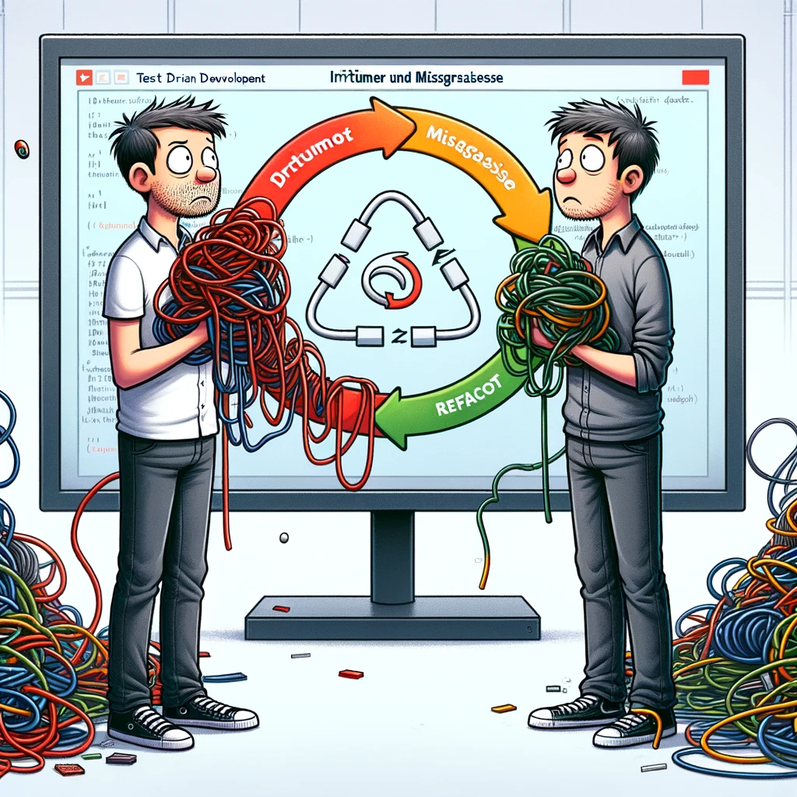
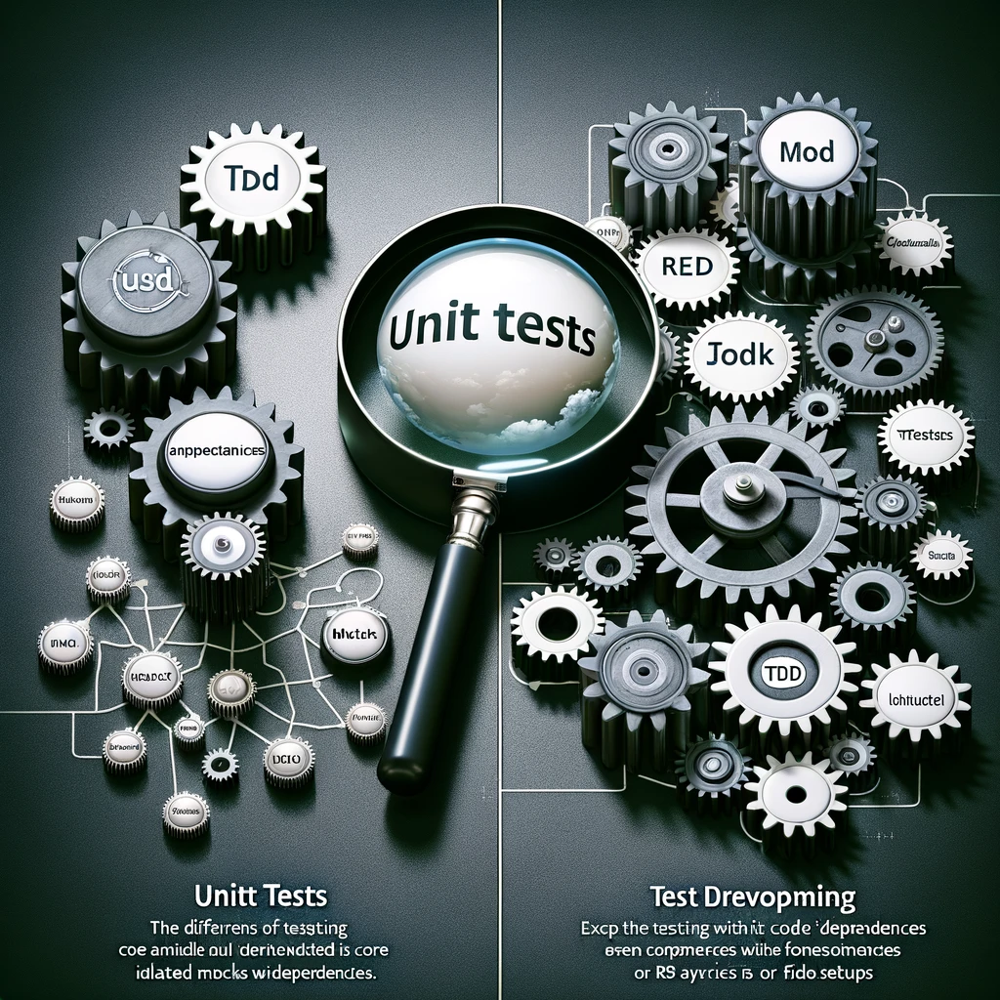
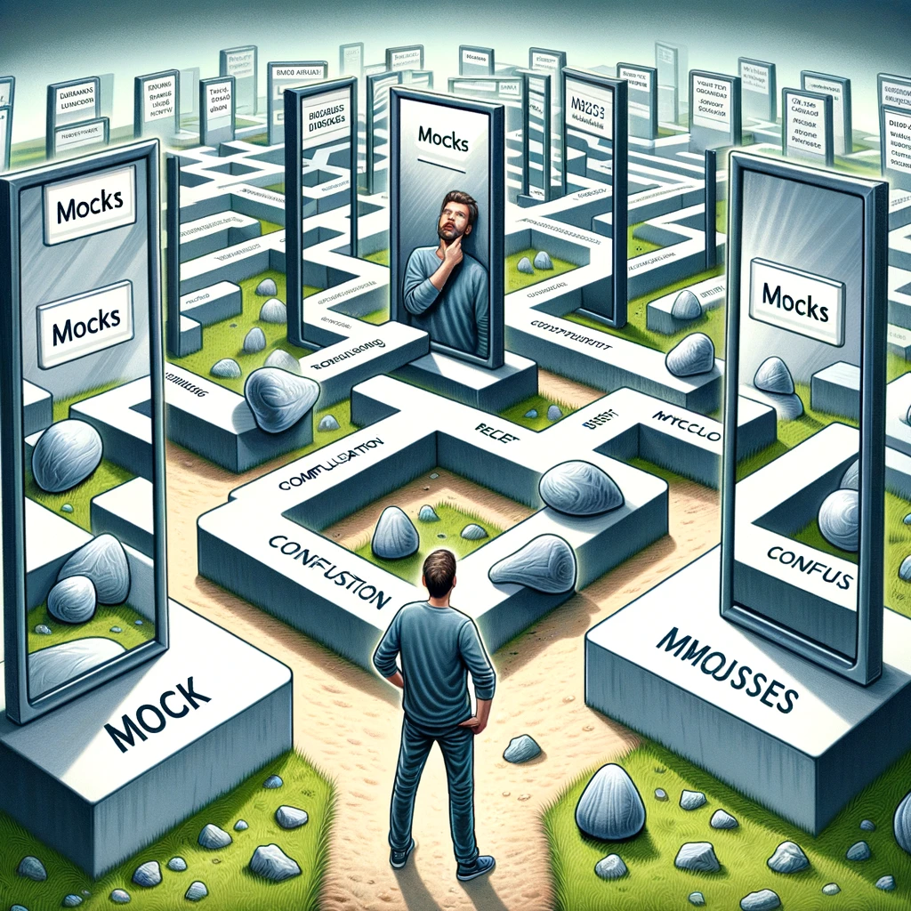
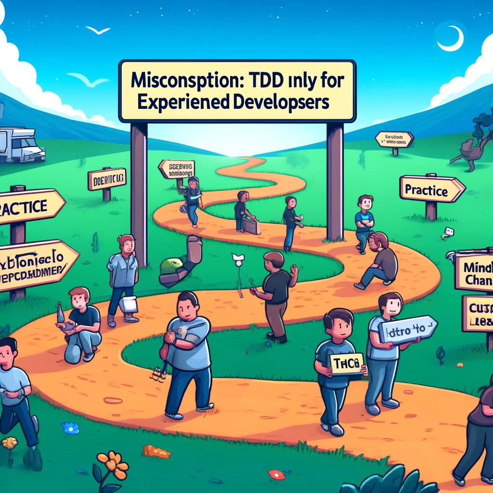
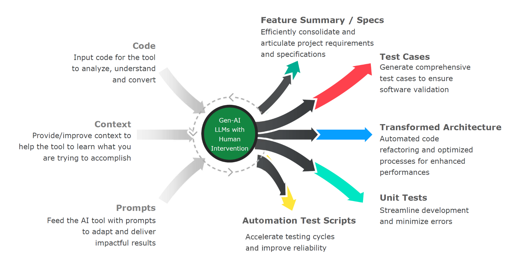
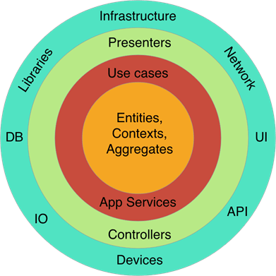

# An Test-driven Development gescheitert? Hier erfährst du, warum.
## Fallen und Missverständnisse vermeiden

<!--
 Herzlich Willkommen zum Vortag TDD


 Schön dass Ihr da seid! 
 An Test-driven Development gescheitert? Hier erfährst du, warum.

In Teil zwei widmen wir uns schwerpunktmäßig einem kuriosen Phänomen: Immer wieder hören und lesen wir in Fachbeiträgen oder auf Konferenzen von TDD, 

aber kaum jemand kennt Entwickelnde, die wirklich konsequent „TDD machen“. Warum ist das so? 

Warum ist TDD so schwer zu lernen, welche Missverständnisse und Fallen führen uns in die Irre und wie kannst du es doch schaffen, Projekte mit TDD zum Erfolg zu führen? 

Wir versuchen herauszufinden, wie du TDD in deinen Projekten implementierst (oder vermeidest) 

und ob TDD überhaupt noch sinnvoll ist, wenn die KI sowieso alles für dich programmiert und testet – dabei klären wir alle Fragen, die du zum Thema mitbringst. Let's discuss!

Teil 2 (16:30 Uhr – 18:00 Uhr): Test-Driven Development (TDD): Du bist an TDD gescheitert? Hier erfährst du warum. Welche Fallen es bei TDD zu vermeiden gilt
Warum „Test-First“-Prinzip von TDD  besser ist als „Test Last“ haben wir im vorherigen Vortrag geklärt. Jetzt geht es um die Fragen was man bei TDD alles falsch machen kann und wie man das vermeidet – und, ob TDD in Zeiten von KI überhaupt noch relevant ist.
-->
---

# Warum bis **du** hier ?

<!--
kann schon früher starten bis die Nachzügler kommen

Stimmen aus dem Publikum, jeweils 1-2 Sätze

was erwartest du ?

Warum ausgerechnet in einem TDD - Vortrag ?
-->

---

# Was Ihr mitbringen solltet

* Verständnis der Grundbegriffe von TDD
* mindestens mal ein Tutorial mit einem praktische Beispiel gemacht
* Durchhaltevermögen auch bei schwierigen Situationen
* keine Pläne noch jahrelang in einem Legacy - Projekt ohne Testabdeckung zu arbeiten

<!--
Warum bin ICH hier und was biete ich hier an  ? 

Voraussetzung: Verständnis von TDD als Prozess, bei dem Tests vor dem Code geschrieben werden.

Also würde ich erwarten, dass ihr zumindest versteht, dass TDD ein Prozess ist, bei dem wir Tests schreiben, bevor wir den Code schreiben. 

Zyklus von Rot zu Grün und Refactoring: Fehlschlagende Tests schreiben und dann passieren lassen.

Zyklus von Rot zu Grün der Test und dann Refactoring: 

  * einen fehlschlagenden Test schreiben, 

  * dann diesen Test bestehen lassen. 

  * Refactoring durchfürhen, um die Qualität unseres Codes zu verbessern. 
-->

---

# Was euch erwartet

* hauptsächlich theoretischer Vortrag 
* nur ein Codebeispiel
* kleiner Einblick in KI-gestütztes TDD -Entwicklung

<!--


-->

---


# Wie viel TDD - Praxis hast du ?

[Mentimeter](https://www.mentimeter.com/app/presentation/alhyyrr74bsywk5qzdr4eoki42pem5nz/present?question=wfsznf3agy6m)

---

## Wer ich bin:
* Bodo Teichmann
* Softwareentwickler seit mehr als 30 Jahren
* "early adopter" von TDD 
* 6 Jahre `C` Erfahrung, 10 Jahre `Java`
* CI-Automatisierung, ein wenig `Angular`, diverse Script Sprachen, 
* zuletzt 3 Jahre `Spring Boot` 
<!--
* Hobbies: Musik, Fliegen, Tanzen 
-->

---


# TDD, ganz einfach ?

<!--
Schöne graphic für ein Buchcover oder ein Präsentationsfolie

* Ist aber leider sehr Irreführend

-->

---

<!-- 
footer: '🔗https://substack.com/home/post/p-139601698'  
backgroundImage: url(assets/images/Cannon-TDD.png) 
backgroundSize: 103% 103%
backgroundPosition: top 0px right 0px
-->


<!--

* kommt der Sache schon etwas näher,
* orangenen Kästen weisen auf häufig begangene Fehler hin 

* erfasst aber eigentlich noch nicht alle wichtigen Aspekte!

* Flowchart vom Autor Kent Beck selbst autorisiert 
* zugehöriger Text im Substack Link zu finden.

-->

---
<!--  footer: '🔗https://bodote.github.io' 
backgroundImage: url(assets/images/BRANDAD_Logo.png)
backgroundSize: 150px 
backgroundPosition: top 20px right 20px
-->


# 7 Irrtümer von TDD

<!--
Es gibt viele Missverständnisse rund um TDD und man kann viel falsch machen

Das sage ich nicht um euch von TDD abzuhalten, sondern ich um euch vorzuwarnen 
dass es nicht so einfach ist , wie es aussieht

* hoffentlich klar, dass ich der Meinung bin , dass sich der Aufwand lohnt TDD richtig zu lernen
(unter bestimmten Umständen!)
-->

--- 

# .. oder "Über 7 Brücken musst du gehen, 7 dunkle Jahre überstehen"
<audio controls>
  <source src="assets/jingles/7bruecken_chorus.mp3" type="audio/mpeg">
  Your browser does not support the audio element.
</audio>

---

<!--  footer: '🔗https://bodote.github.io' 
backgroundImage: url(assets/images/7Bruecken.png)
backgroundSize: 100% 100% 
backgroundPosition: top 0px right 0px
-->

---


# Irrtum 1: Softwareentwickler schreiben Unittest 
<!--  TDD ist nicht gleichzusetzen mit Unit-Tests.

Der erste und vielleicht bedeutendste Irrtum der testgetriebenen Entwicklung ist, dass Entwickler "Unit"-Tests schreiben. Nichts könnte weiter von der Wahrheit entfernt sein. 

-->
<!--  footer: '🔗https://bodote.github.io' 
backgroundImage: url(assets/images/BRANDAD_Logo.png)
backgroundSize: 150px 
backgroundPosition: top 20px right 20px
-->

---
# Irrtum 1: Softwareentwickler schreiben Unittest 
## Falsches Verständnis von "Unit" . 

* **alte** Wikipedia definition: "Unit testing refers to verifying the behavior of a **relatively small portion** of the code, a unit, in **isolation from the rest of the codebase**. A unit is often a **function**, module, **method** or **class**. [21] To isolate the unit, a test substitutes dependences with test doubles."

* [Wikipedia neu:](https://en.wikipedia.org/wiki/Software_testing#Unit_testing) Unit testing, a.k.a. component or module testing, is a form of software testing by which isolated source code is tested to validate expected behavior.

<!--
jedenfalls die "Unittest", die   Wikipedia beschreibt 

1. dass das  Problem soll isoliert werden soll. OK

2. eine UNIT sei eine Funktion , Modul oder Klasse (2 von 3 falsch)

3. Methoden-Stubs, Mock-Objekte, Fakes und Test-Harnesses können verwendet werden, um das Testen eines Moduls in Isolation zu unterstützen. VORSICHT FALLE

4. das man die UNIT isoliert testen soll, OK

Zum Lernen METHODE = UNIT ok, aber komme so schnell wie möglich davon wg. zu viel größeren UNITs

von den 4 Aussagen hilft für TDD nur die letzte so halb weiter, nämlich: 
 
Jeder Testfall sollte UNABHÄNGIG von anderen sein,

 -->

--- 

# Irrtum 1: TDD ≠ Unittesting

* Unit-Tests laut Wikipedia-Definition konzentriert sich auf die __Isolation__ von Fehlern in einer **_Unit_** durch den **Einsatz von Test-Doubles**.

<!-- 
# __Isolation__ von Fehlern in einer Komponente scheint erst einmal eine Gute Idee
# ist es aber nicht
-->

--- 

# Irrtum 1: Das große "Unit" Missverständnis (1) 

* Isolation der **Test**: JA! 
* Isolation der getesteten **"Units"** durch **"test doubles"** : vermeide wenn möglich
* **Unit** = zusammengehörige Code-Teil (im Sinne von DDD ) , also ein "Modul" mit definierter API : Prima !
* **Unit** = Java- oder TypeScript - **Klasse** : großes **Missverständnis** !
<!--

Unit als Funktion oder Klasse ist schlicht FALSCH, wenn wir TDD machen wollen ! 

ABER OK, wenn du grad die Grundbegriffe lernst

Vorsicht SACKGASSE!

sondern ein größere MODUL mit einer stabile API

-->
---


# Irrtum 1: "Unit" Missverständnis (2)
* "Unit" im Sinne von Kent Beck (Autor von TDD): GUT!
* J-"Unit" als Tool: sehr hilfreich, (ebenso: Jasmin, Jest)
* "Unit" als einzelne Klasse und "wegmocken" aller Dependecies : **SCHLECHT**!

<!-- 
WEIL: nächste Folie
-->

---

# Irrtum 1: Warum sind "Unit" Tests schlecht? (1)
* zu enge Kopplung von Test zu Implementierung 
* zu enge Kopplung an Interna (private methods) der Implementierung

# Führt zu: 
* Tests, die Refactoring extrem erschweren


<!-- 
# NAIVE Herangehensweise:

* im Tutorial ok: 1 Klasse -> eine Testclasse 
* im Tutorial ok: je Entscheidung in jeder Methode je eine Test-Methode

# Völlig OK , sich so TDD anzunähern 

# Völlig falsch , in nicht trivialen Projekten dabei zu bleiben

-->
---

# Irrtum 1: Warum sind "Unit" Tests schlecht? (2)
## Weil : Upfront-Design aller Implementierungsdetails nötig
* Test sollen das Design "treiben" ("driven") nicht umgekehrt
* Vorteil von TDD fürs Design wird verschenkt
* statt dessen : Upfront-Design **NUR** für die API gegen die die Test geschrieben werden
<!--
Denn Wenn ich auf Klassenebene testen will muss ich die Klassen auch vorab Designen
* Methodennamen und - Parameter festlegen sonst kompiliert mein Test ja gar nicht
* führt zu diese engen Kopplung
* änderen sich meine Klassen auch nur minimal (z.B. Methode verschieben von Klasse A zu Klasse B) muss sich auch mein Test ändern

Das wollen wir vermeiden !

-->
---
<!-- _class: lead -->
# Korrektur des Irrtum 1 mit API (1): 
* Teste Module mit stabiler API
* API-Design **vor** dem schreiben der Tests
* Implementierung **nach** dem schreiben des Tests
* Test greift nur auf stabile API zu 
* bei Backends: **EINE**  eine API für 5-20 Klassen 

<!--

__API__ für ein "Modul" , das vielleicht 10-100 Klassen enthält

Beispiel zu API-Design **vor** dem schreiben der Tests 

* API == "REST Controller" mit INput/Output festlegen

-->


---

# Irrtum 2: Verwende Mocks wo es nur geht
prüfe wo du Mocks oder andere Test Doubles verwendetst
* Mocks für Klassen in DEINEM Code -> ganz schlecht
* viele Mocks -> enger Kopplung von Test zu Code -> deutlich erschwertes Refactoring
<!--
# Wenn du viele Mocks in deinem Code für deine eigenen Codeteile verwendest, fürht das zwangsläufig zu einer
engen Kopplung der Tests an deine IMplmentierung die Refactoring exterm erschwert und 

# du musst deine Tests dauern ändern
-->


---

# Irrtum 2: Verwende Mocks wo es nur geht
im Gegenteil: Mocks nur sehr sparsam verwenden
* Mocks nur für **externe** Dependencies (externe Services, Filesystem)
* In Frontend-Test : Mock für Backend ok

<!--

Verwendung von Test Doubles , Mocks , Spys sind guter Indikator ob du auf dem richtigen Web bist 
-->
---


# Irrtum 3: TDD ist unflexibel
* stimmt, wenn zu viel Mocks und Tests an die Implementierung statt an die Anforderungen gekoppelt sind
* stimmt, wenn du den "refaktorieren" - Teil des TDD nicht wirklich ernst nimmst
---


# Irrtum 3: TDD ist sehr flexibel wenn du 
* größere "Units" mit API testest
* wenig Mocks hast.
* sobald der Test grün✅ 
🔵refaktorieren🔵, 
<!--
Zu Wenig Refactoring ist ein Anzeichen dafür, dass effektiv ein up-front-Design der Implementierung vorliegt, 

und dass damit die Test zu eng an die Implementierung gekoppelt ist.

denn in der __grünen__ Phase solltest du alles tun, was du kannst, um den Algorithmus zu finden, den du benötigst, um den Test zu bestehen. 

Code / CodeStruktur verbessern in der __blauen__ Phase, sobald er den Test besteht, denn jetzt weißt du genau, welchen Code du brauchst, um den Test zu bestehen, und du kannst dann refaktorieren, um qualitativ hochwertigen Code zu schreiben.
-->
---

# Irrtum 4: TDD kostet viel Zeit und verlangsamt die Entwicklung
* ja, wenn du es falsch angehst (siehe Irrtum 1 und 2)
* vielleicht ja:  Projekt klein, kurzfristig oder nur  Proof Of Conzept 
* vielleicht ja: Legacy Projekt ohne gute Testabdeckung

<!--
TDD als Teil des Softwareentwicklungsprozesses passt nicht immer

Bewusste Entscheidung nötig

__Legacy__ Projekte ohne gute Testabdeckung: TDD nachträglich praktisch unmöglich. 

Es sei denn man schafft es für neue Features neuen Code zu schreiben der sehr weitgehend vom Legacy Projekte separiert ist. 

Heißt: API für Legacy Code muss definiert und umgesetzt werden an dem man den neuen Code "Andocken" kann. 

Das kann eine getrennte deploybare neue Codestructur sein (ich vermeide den Begriff Microservice)

Das kann aber auch ein mit dem Legacy Code gemeinsam deploybares Modul sein. 

Dann aber: Stelle sicher, dass alle Dependencys die API nicht verletzten (ArchUnit)

Sonst wird der neue Code ganz schnell wieder im Spagettibrei des Legacy Codes vergammeln.
-->

---

# Irrtum 4: TDD kostet viel Zeit und verlangsamt die Entwicklung
* nein, wenn du das Konzept wirklich ausnutzt
* nein, wenn dein Projekt groß und langfristig ist


<!--
weitere __negativ__ faktoren: 

## geänderte Anforderungen->geänderte Test, aber die Test müsse leicht verständlich sein, was sie oft nicht sind

 __positiv__

## du sparst viel zeit beim suchen und fixen von Bugs, weil TDD-Software viel stabiler ist.

## du sparst zeit beim Refactoring weil deine tests nicht dauernt brechen

## TDD zahlt sich vor allem längerfristig aus, je größer das Projekt desto mehr
-->

---

# Irrtum 5: TDD ist nur für erfahrene Entwickler
* nein: andere Denkweise🧐 und Lösungsstrategie
* unabhängig von Vorerfahrung
* TDD **nicht ein Ziel** an dem man schnell ankommen will
* TDD ist ein **langer UND sehr interessanter** Weg 


<!--
Angeblich wäre TDD nur für erfahrene Entwickler: Stimmt nicht, ich hab TDD und Java damals gleichzeitig gelernt

TDD kann eben auch für weniger Erfahrene eine Hilfe beim Lernen sein, weil es anregt kritisch über den eigenen Code nachzudenken. 

TDD bietet eben große Sicherheit beim Ändern von Code, was wiederum das Lernen beschleunigen kann.

TDD erfordert aber auch Disziplin und eine Verständniss der Testprinzipien

-->

---

# Irrtum 5: TDD ist nur für erfahrene Entwickler
* ⚡️ Fehler:  
  * Anforderung -> Implementierung : FALSCH !! ⚡️
* 😎 Statt dessen : 
  * Anforderung -> Wie Anforderung testen ? 😎


---

# Irrtum 6: die Namen meiner Test-Methoden sind egal
* wenn du das denkst, schießt du dir selber ins Knie, 
* das Problem potenziert sich, wenn du auch noch viele Mocks verwendest

<!--

Beispiel folgt nach Irrtum 7

Solange sich die Anforderungen nicht ändern (sondern nur neue hinzu kommen) ändern sich auch die Tests nicht

ABER: wenn bestehende Anforderunge geändert werden MÜSSEN sich die Tests ändern-> je leichter lesbar die sind , desto leichter lassen sie sich ändern

-->

---

# Irrtum 7: BDD ist toll: der PO schreibt jetzt meine Tests
* BDD = "Behaviour Driven Development" 
* das wird nicht passieren, PO schreibt keine Tests
* BDD - tools wie Gherkin oder JBehave führen zu nichts als Overhead für den Entwickler
* besser : JGiven: Entwickler schreibt, PO liest
<!--
BDD : es geht nicht um Tools sondern ums Konzept

BDD: besserer Name für TDD ?

oder noch besser: Entwickler schreibt UND versteht seine Tests auch noch nach 2 Wochen


Beispiel folgt gleich
-->
---

<!--  footer: '🔗https://bodote.github.io' 
backgroundImage: url(assets/images/7Bruecken.png)
backgroundSize: 100% 100% 
backgroundPosition: top 0px right 0px
-->

---
# Nochmal "Über 7 Brücken musst du gehen, 7 dunkle Jahre überstehen" ? 

<audio controls>
  <source src="assets/jingles/7bruecken_chorus.mp3" type="audio/mpeg">
  Your browser does not support the audio element.
</audio>

<!--  footer: '🔗https://bodote.github.io' 
backgroundImage: url(assets/images/BRANDAD_Logo.png)
backgroundSize: 150px 
backgroundPosition: top 20px right 20px
-->
---


# Aus Irrtum 6 + 7 kann was gutes entstehen (1):
* schreibe  Tests-Methoden so, dass der PO den Test lesen, verstehen und gegen seine Anforderungen und Akzeptanzkriterien abgleichen kann
* Prima: jetzt verstehst du selber die Tests auch nach 4 Wochen noch!
<!--  footer: '🔗https://bodote.github.io' 
backgroundImage: url(assets/images/BRANDAD_Logo.png)
backgroundSize: 150px 
backgroundPosition: top 20px right 20px
-->

---

# Aus Irrtum 6 + 7 kann was gutes entstehen (2):
 einfaches Beispiel:
<!--
 *** IDEE: Zuhörer zwei Gruppen , erste Gruppe schaut 15sec den ersten test an 2. gruppe 15 den zweiten ***
Du könntest einen Test so schreiben:
-->

---


```java
@Test
void test10() {
    driverPath =
            new File("/Users/bodo.teichmann/dev/learning/tddJavaMaven/chromedriver-mac-arm64/chromedriver");
    ChromeDriverService service = new ChromeDriverService.Builder()
            .usingDriverExecutable(driverPath)
            .build();
    WebDriver driver = new ChromeDriver(service);f
    WebDriverWait wait = new WebDriverWait(driver, Duration.ofSeconds(10));
    try {
        driver.get("https://bodote.github.io/");
        String title = driver.getTitle();
        assertEquals("Die meisten Menschen… - Bodos Software Blog", title);
        WebElement searchLink =
                wait.until(ExpectedConditions.visibilityOfElementLocated(By.className("fa-search")));
        searchLink.click();
        WebElement searchBox = wait.until(ExpectedConditions.visibilityOfElementLocated(By.id("search")));
        searchBox.sendKeys("TDD");
        WebElement post =
                wait.until(ExpectedConditions.visibilityOfElementLocated(By.linkText("TDD Where it did go wrong")));
        post.click();
        WebElement postHeader = wait.until(ExpectedConditions.visibilityOfElementLocated(By.id("page-title")));
        assertEquals("TDD Where it did go wrong", postHeader.getText());
        List<WebElement> foundLinks = wait.until(
                ExpectedConditions.visibilityOfAllElementsLocatedBy(By.xpath("//li//ul/li/a | //li//ol/li/a")));
        var found = foundLinks.stream().anyMatch(link -> link.getText().contains("because"));
        assertTrue(found);
    } finally {
        driver.quit(); // Make sure to quit the driver to free up resources
    }
}
```

<!--
30sec lesezeit

Und es sagt nicht, was dieser Code tun soll.

Wenn du das genau studierst und etwas über Webentwicklung und Selenium, das Selenium-Testframework, weißt, könntest du vielleicht nach sorgfältigem Lesen herausfinden, was dieser Test tut.

Oder ich könnte den Test so schreiben, und jetzt weißt du genau, was dieser Code tun soll.
-->
--- 


```java
@Test
void should_find_a_blog_about_TDD() {
  given().a_web_site("https://bodote.github.io/");
  when().search_menu_is_clicked()
          .and()
          .search_term_$_is_typed("TDD");
  then().blog_post_$_should_be_found("TDD Where it did go wrong")
          .and()
          .when_clicked_$_should_be_the_title("TDD Where it did go wrong");
}

```

<!--
30sec lesezeit
-->

--- 

Der 2. Test erzeugt einen Report mit  `jGiven`:
```
Test Class: jgiven.BlogTest

 Should find a blog about TDD

   Given a web site "https://bodote.github.io/"
    When search menu is clicked
     And search term "TDD" is typed
    Then blog post "TDD Where it did go wrong" should be found
     And when clicked "TDD Where it did go wrong" should be the title
```
<!--
30sec lesezeit
-->
---

# Sehr gut lesbare Testmethoden:
* helfen, sich schnell im Testcode zurecht zu finden, wenn sich Anforderungen ändern.
* dienen nun **tatsächlich** als Dokumentation


<!-- jetzt hast du keine Ahnung, wie der getestete Code tatsächlich funktioniert. Du weißt nicht einmal, ob dies eine Webanwendung ist.

ABER: du verstehst sofort um welche fachlichen Anforderung es hier geht, und das ist viel hilfreicher.

Nur um klar zu sein, dies sind dieselben Tests.-->
---

# TDD und AI-assisted coding

Ist TDD in Zeiten von KI-unterstützter Sofwareentwicklung noch sinnvoll ?


---

<!-- footer: '🔗https://www.publicissapient.com/insights/guide-to-ai-assisted-software-development'  
backgroundImage: url(assets/images/ai-assisted-development.webp) 
backgroundSize: 103% 103%
backgroundPosition: top 0px right 0px-->

---

# AI-assisted coding mit Cursor und TDD 
Live Beispiel 
<!--  footer: '🔗https://bodote.github.io' 
backgroundImage: url(assets/images/BRANDAD_Logo.png)
backgroundSize: 150px 
backgroundPosition: top 20px right 20px
-->

<!--
seit vieleicht einem halben Jahr echt möglich 

Cursor zeigen, Montor auf "spiegeln" 
-->

---

# Quellen: 
* https://bodote.github.io/blog/TDD-Video-Tips
* praktisch alle Fehler schon selbst begangen, also eigene Erfahrung

---

# Danke für eure Aufmerksamkeit!

---


# BRANDAD Development GmbH

* Wir suchen Softwareentwickler, Scrummaster, Product Owner, UI/UX-ExpertInnen
* viel Angular und Spring-boot, aber auch anderen Frameworks, offen für neues
* [https://brandad.dev](https://brandad.dev)

---


# BRANDAD Development GmbH

* Wir suchen Softwareentwickler, Scrummaster, Product Owner, UI/UX-ExpertInnen
* viel Angular und Spring-boot, aber auch anderen Frameworks, offen für neues
* [https://brandad.dev](https://brandad.dev)

---

# Euer Feedback ist wertvoll!
---
# Reservefolien

---

# Welches Architekturmuster verwendest du ?
* keines 
* layered 
* hexagonal
* onion
* "Clean" 
<!--
Starker Einfluss der gewählten __Softwarearchitektur__ (Clean , Hexagonal, Zwiebel, Layerd)

* ARCHITEKTUR: du sollest eine API auch zwischen den 
  * "Layern", oder "Zwiebelringen" , 
  * Hexagonal: "Infrastruktur" und "Application" code. 
  * Clean Architecture: zwischen "Application Business Rules" und "Interface Adapters"

# Wichtig : API sollte sich nicht dauernd ändern
-> oder wenn, dann möglichst rückwärtskompatibel 

-->