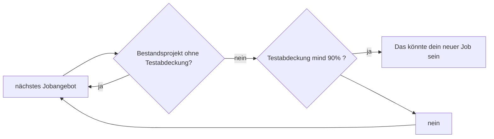

```mermaid
flowchart LR
   JS[nächstes Jobangebot]  --> id1{Bestandsprojekt ohne Testabdeckung?} -- ja --> JS
   id1 -- nein --> TA{Testabdeckung mind 90% ?} -- ja --> JG[Das könnte dein neuer Job sein]
   TA --> nein --> JS
```

