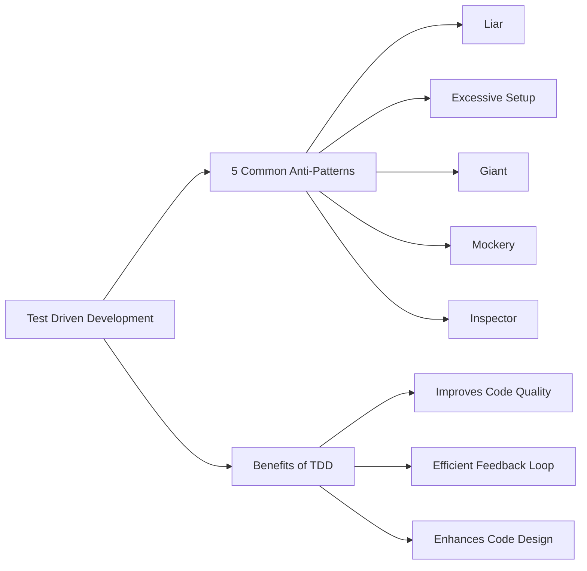

```mermaid
graph LR
    TDD[Test Driven Development] --> AntiPatterns[5 Common Anti-Patterns] 
    AntiPatterns --> Liar[Liar]
    AntiPatterns --> ExcessiveSetup[Excessive Setup]
    AntiPatterns --> Giant[Giant]
    AntiPatterns --> Mockery[Mockery]
    AntiPatterns --> Inspector[Inspector]
    TDD --> Benefits[Benefits of TDD]
    Benefits --> Quality[Improves Code Quality]
    Benefits --> Feedback[Efficient Feedback Loop]
    Benefits --> Design[Enhances Code Design]
```