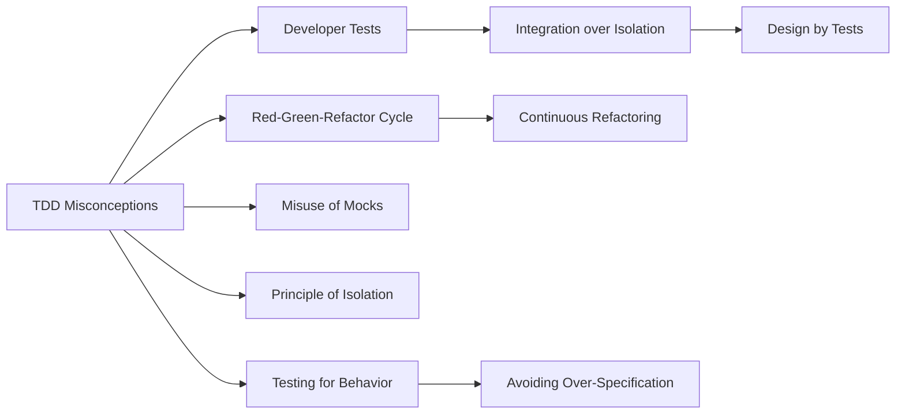

```mermaid
graph LR
    TDD[TDD Misconceptions] --> DeveloperTests[Developer Tests]
    TDD --> Cycle[Red-Green-Refactor Cycle]
    TDD --> Mocks[Misuse of Mocks]
    TDD --> Isolation[Principle of Isolation]
    TDD --> Behavior[Testing for Behavior]
    DeveloperTests --> Integration[Integration over Isolation]
    Cycle --> ContinuousRefactoring[Continuous Refactoring]
    Behavior --> AvoidOverSpecification[Avoiding Over-Specification]
    Integration --> DesignByTests[Design by Tests]
```