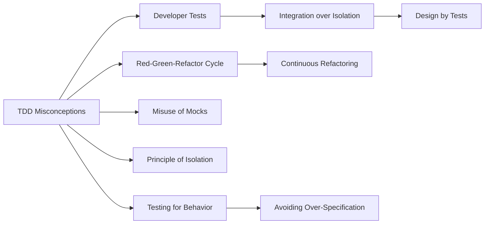
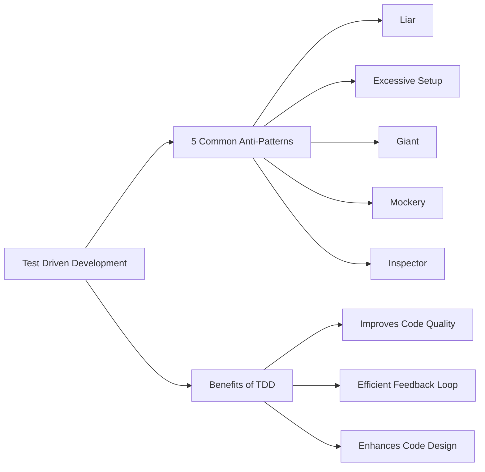

# High level Videos about TDD:

## [TDD, Where Did It All Go Wrong (Ian Cooper)](https://youtu.be/EZ05e7EMOLM?si=fydSo58rklUexrBO&t=1334)

The video highlights several common misconceptions about Test-Driven Development (TDD) that often lead to challenges and resistance in its adoption and practice. Let's delve into these misconceptions in more detail:

### Misconception 1: TDD is Only for Unit Testing

Many developers mistakenly believe that TDD is exclusively about unit testing, focusing solely on the smallest parts of the application in isolation. While unit testing is a significant aspect of TDD, the methodology's core goal is to ensure that the entire system meets its requirements and behaves as expected. TDD encourages testing at multiple levels, including integration and acceptance testing, to validate the software's behavior comprehensively.

### Misconception 2: TDD Slows Down Development

A prevalent misconception is that TDD significantly slows down the development process because writing tests before implementation requires additional time and effort. While it's true that TDD involves an upfront investment in writing tests, this approach often leads to higher-quality code, fewer bugs, and less time spent on debugging and fixing issues later. In the long run, TDD can accelerate development by facilitating easier code maintenance and making the codebase more adaptable to changes.

### Misconception 3: TDD is Inflexible

Some developers view TDD as an inflexible methodology that imposes rigid rules on the development process. They may feel that having to write tests before implementing functionality constrains creativity and innovation. However, TDD is meant to be a guide rather than a strict set of rules. It promotes a disciplined approach to software development but allows for flexibility in how tests are written and how the development is structured.

### Misconception 4: TDD Guarantees Bug-Free Software

Another misconception is the belief that following TDD guarantees that the software will be free of bugs. While TDD significantly improves code quality by identifying and resolving issues early in the development cycle, it's not a silver bullet that eliminates all bugs. The effectiveness of TDD depends on the quality of the tests written and the completeness of the test coverage. It's still possible for bugs to exist in areas not covered by tests or due to incorrect test assumptions.

### Misconception 5: TDD is Only for Experienced Developers

There's a notion that TDD is suitable only for experienced developers and that beginners or less experienced team members will struggle with the methodology. While TDD does require a certain level of discipline and understanding of testing principles, it can also be an invaluable learning tool for less experienced developers. TDD encourages developers to think critically about their code's design and behavior, which can accelerate the learning process and improve overall development skills.

Understanding and addressing these misconceptions is crucial for teams considering adopting TDD. By clarifying these misunderstandings, developers can more effectively harness TDD's benefits to improve software quality, reliability, and maintainability.

This video discusses the speaker's experiences and insights into the practice and challenges of Test-Driven Development (TDD), exploring both its potential benefits and its common pitfalls. The speaker, who has been practicing TDD since around 2004, reflects on how TDD practice has evolved over time, the resistance to it, and how to effectively implement it to avoid common mistakes.

### Takeaways

📈 **Personal Growth**: Engaging in public speaking and community contributions can significantly enhance a developer's ability to articulate and share ideas.

💡 **Evolution of TDD**: The speaker's journey with TDD reveals that the approach to software testing and development is not static but evolves with experience and insight.

🚀 **Importance of Community**: The cross-fertilization of ideas within the developer community has been crucial for the adoption and evolution of practices like TDD.

🤔 **Challenges with TDD**: Despite its benefits, TDD has faced resistance due to its perceived complexity and the overhead of maintaining extensive test suites.

🔄 **Refactoring**: The process of refactoring is essential for maintaining code quality but can be hindered by rigid tests that focus too much on implementation details.

📚 **Educational Resources**: The speaker emphasizes the importance of foundational texts, such as Kent Beck's book on TDD, for understanding core principles.

👥 **Audience Engagement**: The speaker notes the difficulty in engaging non-technical stakeholders with testing and the importance of making testing relevant to them.

🚧 **Implementation Details vs. Behavior**: A key insight is the importance of testing the behavior of software rather than its implementation details.

🔄 **Continuous Learning**: The journey of mastering TDD is ongoing, highlighting the need for continuous learning and adaptation.

🔍 **Focus on API**: Concentrating on testing the public API of a module rather than internal details can lead to more resilient and meaningful tests.

### Summary

1. The speaker has practiced TDD since 2004 and has seen its evolution and the varying degrees of acceptance within the developer community.
2. Initially, there was a lot of resistance to TDD, with many seeing it as unnecessary or too complex.
3. Over time, the speaker recognized the challenges of maintaining large test suites and the importance of focusing on testing behaviors rather than implementation details.
4. The importance of foundational knowledge in TDD, as emphasized by Kent Beck's writings, is highlighted as crucial for understanding and effectively applying TDD principles.
5. The speaker discusses the challenges of engaging with non-technical stakeholders and the importance of making the benefits of TDD clear to them.
6. A shift in focus from testing specific class methods to testing the public API and behavior of software modules is advocated for more effective TDD.
7. The video explores the importance of community involvement, sharing knowledge, and the personal growth that can come from public speaking and community contributions.
8. The discussion includes insights into the practical application of TDD, the importance of refactoring, and the challenges posed by extensive mocking and tightly coupled tests.
9. The narrative underscores the evolution of the speaker's understanding and practice of TDD, moving from a rigid implementation-focused approach to a more flexible, behavior-driven methodology.
10. Finally, the speaker advocates for a balanced approach to TDD that focuses on meaningful testing, continuous learning, and adaptation to the evolving landscape of software development.

### Pesonal remarks:

- 0- 22:00: arguments against TDD,
- 22:00 - > where did it go wrong?
  - wrong: 1:1 Test:Class, one test per class
  - instead: 1:1 Requirement:Implementation : one set of tests for a requirement, test the public API (not neccessarily a REST API, also library API and such)
  - because: requirements are more stable than implementation
  - use given , when , then

## Updated Version , same topic , same speaker:

[TDD Revisited , where it all went wrong, guidance on what to do instead - Ian Cooper - NDC Porto 2023 (Ian Cooper)](https://youtu.be/IN9lftH0cJc?si=_xnC2IQsdiqu2GDM)

---

This video is an in-depth discussion on the misconceptions surrounding Test-Driven Development (TDD) and proposes a more effective approach to TDD that focuses on testing behaviors rather than implementation details.

### Takeaways

🔍 **TDD Misconceptions**: The speaker clarifies that TDD is not just about unit testing but is a broader methodology for improving code quality through behavior-driven tests.

📖 **Developer Tests**: Emphasis on writing developer (programmer) tests instead of traditional unit tests, aiming at testing the behavior of code rather than its internal structure.

🔄 **Red-Green-Refactor Cycle**: A highlight of the TDD process where tests are written before the code (Red), the code is then written to pass the tests (Green), and finally, the code is refactored to improve quality (Refactor).

🚫 **Misuse of Mocks**: Criticism of over-reliance on mocks and stubs, which can lead to brittle tests that are tightly coupled with the code's implementation details.

🛠 **Principle of Isolation**: The importance of isolating tests to ensure they do not interfere with each other, promoting fast and reliable test execution.

💡 **Testing for Behavior**: A call to focus on testing the external behavior of code units rather than their internal logic, enabling more flexible and maintainable codebases.

🔧 **Avoiding Over-Specification**: Warning against tests that are too specific to the implementation, which can hinder refactoring and lead to "fragile tests."

📐 **Design by Tests**: Using TDD to guide software design, allowing the requirements to shape the code organically without rigid upfront design.

⚙️ **Integration over Isolation**: Advocating for a balanced approach to testing that may include integrating components over isolating every single unit with mocks.

🔄 **Continuous Refactoring**: Encouraging continuous improvement of the codebase through refactoring, which is a core aspect of the TDD cycle.

### Summary

1. The video starts by setting expectations, clarifying that it is not a basic TDD tutorial but a critical analysis of conventional TDD practices.
2. The speaker critiques the prevailing focus on unit testing within TDD, emphasizing that TDD is more about testing behaviors and outcomes.
3. A detailed discussion on the misuse of mocks and how it leads to brittle tests that are over-specified and sensitive to implementation changes.
4. The video highlights the importance of the Red-Green-Refactor cycle in TDD, stressing the role of refactoring in enhancing code quality.
5. It discusses the principle of isolating tests to ensure they do not affect each other, thus maintaining test suite efficiency and reliability.
6. The talk proposes a shift from a unit test-driven approach to a behavior-driven approach, focusing on the functionality and contract of the code.
7. It criticizes the need-driven development approach, which relies heavily on upfront design and mocks, for hindering the natural evolution of code design through testing.
8. The speaker advocates for developer tests that are aimed at the last change made, allowing for easier identification and fixing of issues.
9. The concept of avoiding debugging by designing tests that localize defects to recent changes is explained.
10. Lastly, the video concludes by encouraging developers to focus on the behaviors that their code is supposed to exhibit, rather than the intricate details of how those behaviors are implemented.

### Diagram

Let's visualize the key points discussed in the video:

## When Test Driven Development Goes Wrong (Dave Farley)
[Video link: When Test Driven Development Goes Wrong (Dave Farley)](https://youtu.be/UWtEVKVPBQ0?si=fb-yHhtJlykp6OyH)
The video discusses the value of Test Driven Development (TDD) and outlines common pitfalls encountered by practitioners, emphasizing how these pitfalls can actually guide toward better software design.

### Takeaways
- 🚀 **TDD Importance**: TDD is a significant advancement in software development, promoting high-quality code through a test-first approach.
- 🛠 **Common Mistakes**: The video identifies common anti-patterns in TDD that can hinder its effectiveness, including the liar, excessive setup, the giant, mockery, and inspector anti-patterns.
- 📚 **Learning Opportunity**: These anti-patterns are not just mistakes but opportunities to learn and improve software design and architecture.
- 💡 **Design Feedback**: TDD provides valuable feedback on design quality, indicating areas for improvement when tests are hard to write.
- 📈 **Code Quality**: Embraces modular, cohesive, and well-separated code, leading to better maintainability and evolution over time.
- ❌ **Excessive Setup**: Indicates a lack of consideration for testability during code design, leading to fragile tests.
- 🎯 **Focus on Behavior**: TDD encourages focusing on desired behavior rather than technical details, improving code clarity and purpose.
- 🛁 **Clean Tests**: Advocates for simple, focused tests that avoid excessive setup and multiple assertions, making tests easier to maintain and understand.
- 🔄 **Feedback Loop**: Establishes a fast, efficient feedback loop for continuous design improvement.
- 📖 **Continuous Learning**: TDD is a practice of continuous learning, allowing developers to refine their understanding of good design through testing.

### Summary
1. TDD is highlighted as a critical advancement in software development, emphasizing quality code creation.
2. Five common TDD anti-patterns are discussed: the liar, excessive setup, the giant, mockery, and inspector, each showcasing a specific pitfall in TDD practice.
3. These anti-patterns serve as indicators of areas where software design can be improved.
4. The video explains how difficulties in writing tests signal design flaws, prompting a reconsideration of code architecture.
5. It stresses the importance of modular, cohesive, and well-separated code for easier maintenance and evolution.
6. A significant part of the discussion is dedicated to how excessive setup in tests reveals poor code separation and design.
7. The speaker advocates for writing tests that focus on the desired behavior of the software rather than its implementation details.
8. Clean, focused tests with minimal setup and singular assertions are recommended for clarity and maintainability.
9. TDD establishes a feedback loop that informs developers about the quality of their design, encouraging continuous improvement.
10. The video encourages viewing TDD and its challenges as opportunities for learning and refining software design skills.

### Diagram

# Books:

## Test-Driven Development by Kent Beck

Great choice! Let's dive into "Test-Driven Development" by Kent Beck. I'll work on a detailed summary for you.

### Unraveling the Book

Imagine crafting a masterpiece, not with brushes and paints, but with code. In the world of software development, the masterpiece is not just about the final product but the process it takes to create it. "Test-Driven Development" by Kent Beck introduces a revolutionary approach that emphasizes writing tests before writing the actual code. This method, akin to sketching the outline of a painting before filling in the colors, ensures that the software is reliable, easy to maintain, and meets the user's needs from the very beginning.

### The Essence (80/20)

- **The Red-Green-Refactor Cycle**: At the heart of Test-Driven Development (TDD) is a simple yet powerful cycle. Developers start by writing a failing test (Red), then write the minimal amount of code to make the test pass (Green), and finally, refactor the code to improve its structure and clarity while ensuring the tests still pass. This cycle ensures continuous feedback and a focus on achieving functional goals efficiently.

- **The Importance of Refactoring**: Refactoring is a critical component of TDD. It allows developers to improve the design of their code without altering its behavior. Beck emphasizes that regular refactoring leads to cleaner, more understandable, and more maintainable code, which is crucial for long-term project success.

- **Test Cases as Documentation**: Beck proposes that tests serve not only to verify that the code works as intended but also to document the code's behavior. Well-written tests can provide insights into the requirements and functionalities of the system, acting as a guide for current and future developers.

### The Action Plan

1. **Start Small**: Begin with writing a small and manageable test for a specific aspect of the functionality you want to develop. This approach helps in focusing on one thing at a time, making it easier to troubleshoot and understand.

2. **Run the Test and See it Fail**: Running the test and seeing it fail confirms that your test is working as expected and that it will show a pass when the functionality is correctly implemented.

3. **Implement the Functionality**: Write just enough code to pass the test. This step encourages simplicity and effectiveness in code writing, avoiding unnecessary features.

4. **Refactor and Repeat**: After passing the test, refactor your code to improve its structure and readability. Then, move on to the next test. This iterative process promotes a disciplined approach to development and continuous improvement.

### Blind Spot

One potential blind spot in TDD is the risk of over-reliance on the developer's understanding of the requirements. If the initial tests are based on incorrect assumptions or incomplete understandings, the code may pass all tests but still fail to meet the users' needs. It's crucial to continuously review and adapt tests in light of new information and feedback.

### Connected Knowledge

For those intrigued by TDD, exploring Agile Software Development principles or Continuous Integration and Continuous Deployment (CI/CD) practices can provide a broader context and further improve development processes. Reading about Behavior-Driven Development (BDD) might also offer insights into how testing can be oriented around user behavior and expectations.

Would you like to delve deeper into any specific aspect of "Test-Driven Development" or explore another book? 

Now, let's create a picture that best depicts the essence of "Test-Driven Development" by Kent Beck, followed by an abstract version of the summary.

I've created two illustrations to encapsulate the essence of "Test-Driven Development" by Kent Beck. The first image depicts a software developer immersed in the TDD process, while the second provides an abstract representation of the TDD cycle. 

Feel free to explore these visual summaries, and let me know if there's another book you're curious about or if you'd like to delve deeper into any specific aspect of Test-Driven Development!
