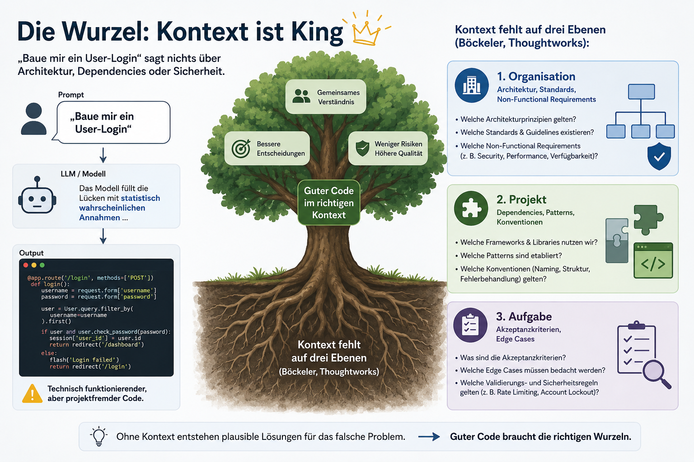

# Spec Driven Development

Warum die Zukunft der AI-gestützten Softwareentwicklung mit der Spezifikation beginnt

---

## Das Versprechen und die Ernüchterung

**Vibe Coding (Karpathy, 2025)**

Einfach drauflos prompten, der AI beim Programmieren zusehen. Prototypen in Tagen statt Wochen — die Euphorie war groß.

**Die Realität**

AI vervierfacht das Tempo, verzehnfacht aber die Sicherheitsrisiken. 80 % der Entwickler umgehen Security-Policies, nur 10 % scannen den AI-Code.

---

<!-- Infografik: Wurzel des Problems -->

---

Was ist Spec Driven Development?

## Die Spezifikation kommt zuerst — als Vertrag zwischen menschlicher Intention und AI-Implementierung.

Eine präzise, maschinenlesbare „Single Source of Truth". Thoughtworks führt SDD im Technology Radar Vol. 32 als empfohlene Technik.

---

## Der SDD-Workflow in vier Phasen

**Specify → Plan → Tasks → Implement**

**Requirements (Given/When/Then) → technischer Plan → atomare Tasks → erst dann generiert die AI Code — mit vollem Kontext über das Was, Warum und die Rahmenbedingungen.**

---

## Die führenden Frameworks (1..3/9)

| Tool | Ansatz | Stärke | Ideal für |
|------|--------|--------|-----------|
| **GitHub Spec Kit** | CLI, 4 Phasen + Constitution | Breiteste Adoption, portabel | Einstieg, bestehende IDE |
| **Fission-AI OpenSpec** | Proposal-zentriert, Delta-Marker | Auditierbares Change-Mgmt | Brownfield & Iteration |
| **BMAD-METHOD** | 12+ Agenten, voller SDLC | Rollengetrennte Multi-Agenten | Komplexe Planung |

---

## Die führenden Frameworks (3..6/9)

| Tool | Ansatz | Stärke | Ideal für |
|------|--------|--------|-----------|
| **AWS Kiro** | Agentic IDE, 3 Phasen, EARS | Agent-Hooks, Auto-Router | Formale Specs, vertraute IDE |
| **Augment Code** | Context-Layer (kein Spec-Autor) | Kontext über Multi-Service-Repos | Große Brownfield-Enterprise |
| **Tessl** | Spec-as-source, Tiles + Registry | Schutz vor API-Halluzination | Langlebige Specs |

---

## Die führenden Frameworks (6..9/9)

| Tool | Ansatz | Stärke | Ideal für |
|------|--------|--------|-----------|
| **Claude Code** | CLI, CLAUDE.md als Spec-Layer | Ausführungs-Agent für SDD-Tools | Autonome Implementierung |
| **Cursor** | Plan Mode + Project Rules | Spec-first ohne Toolwechsel | Mittelweg, vertraute IDE |
| 🟢 **GSD** | Meta-Prompting, Claude Code | Parallele Agenten, 200K Kontext | Lean-Alternative zu BMAD |

---

## GitHub Spec Kit

**Ansatz**

Open-Source-CLI (Python). Workflow mit Checkpoints: Specify → Plan → Tasks → Implement. Unterstützt 30+ Agenten (Claude Code, Copilot, Amazon Q, Gemini CLI).

**Reife**

93.000+ Stars, v0.8.7 (07.05.2026) — die am breitesten adoptierte Open-Source-Option für SDD.

---

## GitHub Spec Kit (Forts.)

**Architektur**

Eine „Constitution" (Markdown) hält unveränderliche Grundprinzipien für alle Sessions fest — der persistente Vertrag zwischen Entwickler und Agent.

**Ideal für**

Default-Einstieg für SDD-Neulinge und die portabelste Option, wenn die bestehende IDE bleiben soll.

---

## Fission-AI OpenSpec

**Ansatz**

Proposal-zentrierter Workflow mit Delta-Markern (ADDED/MODIFIED/REMOVED) — relativ zur bestehenden Funktionalität statt Greenfield-Beschreibung.

**Charakter**

Laut eigener Doku leichtgewichtig & flexibel: liefert Struktur, ohne harte Approval-Gates zwischen den Phasen zu erzwingen.

---

## Fission-AI OpenSpec (Forts.)

**Stärke**

Auditierbares Change-Management. In einer unabhängigen Eval (02/2026, 13 Kategorien, Python-Backend) Gesamtsieger.

**Schwäche / Ideal für**

Proposals sind statisch und können bei langer Umsetzung driften → für große Multi-Service-Vorhaben mit Living-Spec-Plattform kombinieren. Ideal, wenn Doku-Trail vor Living-Spec-Sync geht.

---

## BMAD-METHOD

**Ansatz**

„Build More Architect Dreams" — orchestriert 12+ spezialisierte Agenten über den gesamten SDLC (PM, Architektur, UX, Dev, QA, Scrum Master) mit dateibasierten Handoffs.

**Reife**

MIT-Lizenz, v6.6.0 (29.04.2026), 46.700+ Stars, 5.500+ Forks. Komplett kostenlos, kein Paywall.

---

## BMAD-METHOD (Forts.)

**Architektur**

3 Schichten: BMad Core, BMad Method, BMad Builder. „Cross Platform Agent Team" läuft ohne Umbau auf Claude Code, Cursor, Codex u. a.

**Ideal für**

Teams, die hochstrukturierte, rollengetrennte Multi-Agenten-Workflows ohne Vendor-Lock-in wollen.

---

## AWS Kiro

**Ansatz**

Agentic IDE, die die Intent zuerst formalisiert. Drei Phasen — Requirements, Design, Tasks → requirements.md, design.md, tasks.md. User Stories in EARS-Notation.

**Automatisierung**

Agent-Hooks feuern bei Save/Create und übernehmen Test-Updates, README-Refreshes und Security-Scans ohne manuelles Prompten.

---

## AWS Kiro (Forts.)

**Technik**

Gebaut auf Code OSS (VS-Code-Feeling), CLI + Web. Auto-Router wählt pro Task aus Claude Sonnet, Qwen, DeepSeek, GLM, MiniMax. Kein AWS-Konto nötig.

**Ideal für**

Teams, die formale Spec-Workflows in einer vertrauten Entwicklungsumgebung brauchen.

---

## GSD — Get Shit Done

**Ansatz**

Spec-driven Meta-Prompting / Context-Engineering, primär für Claude Code & kompatible Agenten. Positioniert als lean, low-ceremony Alternative zu BMAD.

**Reife**

61.000+ Stars seit Dez 2025 (von 0 in unter 5 Monaten). Installation via npx, model-agnostisch — auch OpenRouter und lokale Modelle.

---

## GSD — Get Shit Done (Forts.)

**Technik**

Multi-Agenten-Orchestrierung mit parallelen Researchern, Plannern, Executors und Verifiers — jeder in frischem Kontext mit bis zu 200K Token.

**Ideal für**

„Komplexität gehört ins System, nicht in den Workflow." Füllt Lücken von Claude Code: Kontext-Rotation, Quality-Gates, Planungs-State über Sessions.

---

## Tessl

**Ansatz**

Language-agnostic Agent-Enablement. Das Tessl Framework liegt als „Tiles" im .tessl/-Verzeichnis und lehrt jeden MCP-Agenten den Spec-Workflow: fragen → Spec schreiben → Freigabe → implementieren.

**Architektur**

Specs leben im Code als Langzeitgedächtnis → Audit-Trail und kohärente Weiterentwicklung. Zwei Schichten: Prozess- + Library-Kontext.

---

## Tessl (Forts.)

**Differenzierer**

Tessl Spec Registry: offenes Verzeichnis von 10.000+ Specs für externe Libraries („npm für Spezifikationen") gegen API-Halluzinationen.

**Ideal für**

Teams, die Prozess-Chaos UND Doku-Halluzination zugleich verhindern wollen.

---

## Augment Code

**Ansatz**

Setzt am Kontext-Layer an, nicht beim Spec-Authoring. Die Context Engine hält ein persistentes Architekturverständnis über 400.000+ Dateien.

**Stärke**

Schließt die Cross-Repository-Kontextlücke, die Spec-Workflows in großen Multi-Service-Brownfields bricht.

---

## Augment Code (Forts.)

**Kennzahlen**

70,6 % SWE-bench, 59 % F-Score (Hersteller-Angaben — entsprechend einordnen). BYOA: Claude Code, Codex, OpenCode oder nativer Auggie.

**Ideal für**

Enterprise mit komplexen Multi-Service-Architekturen — wo Kontext-Drift, nicht Spec-Erstellung, das Hauptproblem ist. Authort selbst keine Specs.

---

## Claude Code

**Ansatz**

Anthropics agentisches CLI — auf vollautonome Entwicklung ausgelegt: planen, mehrstufige Workflows orchestrieren und nachfragen, ohne ständiges Prompten.

**Spec-Layer**

CLAUDE.md-Dateien erzwingen persistenten Projektkontext, Coding-Standards und Architektur-Constraints über jede Session — de facto SDD.

---

## Claude Code (Forts.)

**Stärke**

Verarbeitet große Spezifikationsdokumente in einer kohärenten Session und generiert Implementierungen in einem Durchgang.

**Rolle**

Häufig unterstützter Ausführungs-Agent quer über BMAD, GSD und GitHub Spec Kit.

---

## Cursor — Plan Mode + Project Rules

**Ansatz**

Plan Mode erstellt vor jedem Code einen reviewbaren Plan: klärende Fragen, betroffene Dateien, Freigabe durch den Entwickler — verhindert verfrühte Code-Generierung.

**Spec-Kontext**

Project Rules unter .cursor/rules/ liefern persistenten, portablen Kontext (das alte .cursorrules gilt als Legacy).

---

## Cursor (Forts.)

**Schwäche**

Kein nativer Spec-Lifecycle, keine Drift-Detection oder Living-Spec-Sync — Spec-Support ist nicht in der Architektur verankert.

**Ideal für**

Strukturierte AI-Entwicklung in einem vertrauten, hochwertigen Editor ohne vollen SDD-Overhead — ein solider Mittelweg.

---

Eine wichtige Einschränkung

## Kein Tool entwirft von allein eine bewusste Architektur — und prüft ihre Einhaltung automatisch.

SDD-Tools steuern den Prozess. Den Architektur-Stil und die deterministische Architektur-Prüfung liefern sie unaufgefordert nicht mit.

---

## Die Lücke im Detail

**Architektur-Stil**

Ein Backend bekommt meist eine simple Layered-Struktur (Controller → Service → Repository) — der Default-Prior der LLMs. Hexagonal / Ports & Adapters wählt ein Agent nur mit Signalen wie DDD oder „Domäne isolieren". Unaufgefordert: unwahrscheinlich.

**Architektur-Tests**

Deterministische Fitness-Functions (ArchUnit & Co.) werden praktisch nie automatisch erzeugt. Die QA-Schritte der Tools zielen auf funktionale Tests — nicht auf Architektur-Konformität.

---

## Warum deterministische Prüfung zählt

**Architektur-Drift**

Eine einmal definierte Architektur erodiert über die Zeit. Jede unbemerkte Abkürzung verfestigt sich — bis Änderungen teuer und riskant werden.

**AI beschleunigt den Verfall**

Coding-Agents erzeugen Code in Minuten. Ohne automatische Schranke vervielfacht sich mit der Geschwindigkeit auch der schleichende Strukturverfall.

**Review skaliert nicht**

Manuelle Reviews übersehen Schichtverletzungen zuverlässig. Ein Test, der bei jedem Build prüft „Domain darf nicht auf Infrastructure zeigen", tut das nie.

---

## Wie die 9 Tools abschneiden

**Am nächsten dran**

BMAD: Der Architect-Agent erzwingt ein Architektur-Dokument samt ADRs. Aber der Stil ist Layered by default, und ArchUnit-Tests entstehen nicht automatisch.

**Nur mit Konfiguration**

Spec Kit (Constitution), Kiro (Steering + Hooks) und Tessl (Methodology-Tile) können beides — aber erst, wenn du es einmalig vorgibst.

**Nicht von sich aus**

GSD, Claude Code, Cursor, Augment Code und OpenSpec entwerfen oder erzwingen einen Architektur-Stil nicht eigenständig.

---

## Der Hebel: Architektur als Regel verankern

**Einmal global definieren**

Die Architektur-Vorgabe einmal projektweit hinterlegen — in der Constitution (Spec Kit), Steering (Kiro), einem custom Architect-Agent (BMAD), einer Tessl-Tile, in CLAUDE.md oder .cursor/rules. Dann gilt sie für jedes Feature, in jeder Session.

**Deterministisch erzwingen**

Fitness-Functions je Sprache als Pflicht-Tests im CI: ArchUnit (Java), ArchUnitNET / NetArchTest (.NET), dependency-cruiser / ts-arch (TypeScript), import-linter / PyTestArch (Python). Verletzung = roter Build.

---

## Was Unternehmen berichten

**HumanLayer**

„Context Engineering" als eigene Disziplin. Code-Qualität proportional zur Spec-Qualität — Spec-Writing wird zur Sprint-Aufgabe.

**Red Hat**

„Spec Coding" zielt auf 95 %+ AI-Code-Accuracy. Strikte Trennung von Was (Mensch) und Wie (AI) steigert auch die Review-Effizienz.

**Enterprise-Trend**

Von Shopify bis EPAM: AI-Nutzung wird Baseline — die Qualität entscheidet sich an der Spezifikation.

---

## Das breitere Ökosystem

**Statischer Kontext**

AGENTS.md (Linux Foundation), CLAUDE.md und Cursor Rules liefern projektweite Standards, Architekturprinzipien und Tool-Konfiguration.

**Dynamischer Kontext**

SDD definiert den feature-spezifischen Kontext. AWS Kiro kombiniert beides plus „Steering Hooks", die bei jedem Save die Spec-Compliance prüfen.

---

## Kritische Einordnung

**Nicht Wasserfall**

Specs sind leichtgewichtig und iterativ, der Feedback-Loop dauert Minuten statt Monate, Specs co-evolvieren mit dem Code.

**Nicht für alles**

Für kleine Scripts und Prototypen bleibt Vibe Coding effizienter. SDD lohnt ab einer gewissen Komplexität und im Team.

**Junges Ökosystem**

Spec Kit, OpenSpec, Kiro & Co. sind unkonsolidiert. Standards fehlen — die Konsolidierung steht noch aus.

---

Fazit & Ausblick

## Klein anfangen: ein bestehendes Feature spezifizieren und den AI-Output mit und ohne Spec vergleichen.

Die Richtung ist klar — AI-gestützte Spec-Generierung, Echtzeit-Compliance und automatische Spec-Updates kommen. Open Source, geringes Risiko, überraschender Unterschied.

---

## Quellen

* Spec Driven Development: Warum die Zukunft der AI-gestützten Softwareentwicklung mit der Spezifikation beginnt — JAVAPRO
  javapro.io/de/spec-driven-development-warum-die-zukunft-der-ai-gestuetzten-softwareentwicklung-mit-der-spezifikation-beginnt

* 9 Best AI Tools for Spec-Driven Development in 2026: Kiro, BMAD, GSD and More — MarkTechPost
  marktechpost.com/2026/05/08/9-best-ai-tools-for-spec-driven-development-in-2026-kiro-bmad-gsd-and-more-compare
